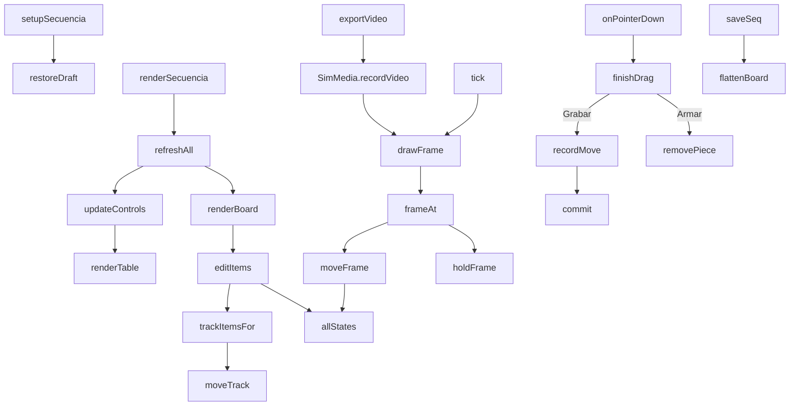

> **Archivada.** Esta solapa se probó y no se eligió (21/09/2026); el código que se describe acá vive en
> `archivo/secuencia/secuencia.js` y la app ya no lo carga. Ver [LEEME.md](LEEME.md) para saber qué quedó y cómo
> reactivarla. Las jugadas de ejemplo (`window.SimTemplates`) hay que volver a exponerlas desde `simulacion.js`
> para que funcione (paso 5 del LEEME).

# js/secuencia.js

La pestaña **Secuencia**: una jugada **grabada moviendo las piezas**. Es la
segunda forma de armar una jugada animada, al lado de
[Simulación](../../codemap/js/simulacion.md) (una foto por fase). Acá no hay fases: se arma
cómo arranca la jugada (**1. Armar**) y después se graba arrastrando las
fichas y la pelota (**2. Grabar**). Cada arrastre queda como un
**movimiento**, dibujado en la cancha con su flecha y el número de su paso, y
como una fila en una tabla editable. Comparte con Simulación el dibujo, el
video y la lista de guardados ([js/simulacion-media.js](../../codemap/js/simulacion-media.md)).

Está dentro de una función que se ejecuta sola (IIFE) y solo expone
`window.setupSecuencia` y `window.renderSecuencia`, que [js/app.js](../../codemap/js/app.md)
llama con un `typeof` de por medio.

## Modelo de datos

Lo guardado es el **arranque** y la lista de **movimientos**; las posiciones de
cada momento no se guardan, se calculan aplicando los movimientos en orden
(`allStates()`). Por eso corregir un movimiento del principio acomoda solo lo
que viene después, algo que en Simulación no pasa (cada fase es una foto).

```
board = {
  initial: [ { type: 'player'|'rival'|'ball', name|label, x, y, carrier } ],   // arranque
  steps:   [ { dur, moves: [ { id, piece, path, kind, to, text } ] } ],        // paso i + 1
  decor:   [ { type: 'text'|'zone', ph, ... } ]                                 // ph = paso donde se ve (0 = arranque)
}
```

- **Paso** (`steps[i]`): un momento de la jugada. Todos sus movimientos ocurren a
  la vez y duran `dur` segundos. "Paso nuevo" al grabar crea un paso;
  "Mismo paso" suma el movimiento al paso actual: así se logra el movimiento
  individual y el simultáneo.
- **Movimiento**: `piece` (`p:Ine`, `r:3` o `b:ball`), `path` (los puntos del camino
  **que se arrastró**, sin el de salida: el de salida es donde estaba la pieza),
  `kind` (`run` para fichas; `pass`, `cross`, `lob`, `shot` o `goal` para la
  pelota), `to` (a qué jugadora le llega la pelota) y `text`.
- **Pelota pegada**: si termina en una jugadora, `to` la nombra y desde ahí va
  con ella (mismo mecanismo que en Simulación).
- Los casilleros sombreados y los textos duran **solo en su paso**: aparecen
  con él y se apagan cuando arranca el siguiente.

Se guarda dentro de `state.simulations` (misma lista y misma hoja
`Simulaciones` que las simulaciones por fases) como una lista plana de items:
un item `seq` (la marca que distingue una secuencia), los items de arranque con
`ph: 0`, un `step` y sus `move` por paso (`ph` = número de paso), y los
`text`/`zone`. `flattenBoard` arma esa lista y `splitFlat` la vuelve a
separar (descartando pasos vacíos y renumerando). Cada pestaña muestra solo lo
suyo: `visibleSims()` de Simulación oculta las que tienen `seq` y
`visibleSeqs()` de acá muestra solo esas. No hace falta cambiar el Apps Script.

## Flujo interno



## Armar y grabar

- **1. Armar**: se arrastran las fichas a su lugar de arranque, se agregan
  rivales y la pelota, se traen jugadoras de Formación y se asigna el plantel a
  los puestos de una jugada de ejemplo. Una ficha arrastrada afuera de la
  cancha se saca (con sus movimientos). La pelota soltada cerca de una jugadora
  se pega.
- **2. Grabar** (`onPointerDown` / `recordMove`): al arrastrar una pieza se van
  guardando los puntos del camino (uno cada 2,5 unidades) y se ve la ficha
  seguir al puntero con un camino punteado. Al soltar, el camino se simplifica
  (Ramer–Douglas–Peucker, ver [[simplificación de trazos]]) y queda como un
  movimiento. Un arrastre de menos de 6 unidades se ignora (es un toque).
  - La pelota soltada cerca de una jugadora es un **pase** a ella; soltada en
    la boca del arco es un **tiro**; soltada adentro del arco es un **gol**
    (`ballLanding`, ver [Arcos y gol](#arcos-y-gol)); en cualquier otro lugar,
    un pase a la zona. El tipo se cambia después en la tabla (`setKind`): al
    elegir tiro o gol la pelota va al arco (a la boca o adentro) y al elegir un
    pase, un centro o un pase por arriba con la pelota hoy en el arco, el
    destino sale del arco (`setKind`).
  - Una misma pieza no puede moverse dos veces en un paso: el nuevo reemplaza.
  - El **cursor** (Inicio, 1, 2...) elige en qué momento se mira y se graba:
    "Paso nuevo" inserta un paso justo después del cursor y "Mismo paso" lo suma
    al paso del cursor. Los pasos siguientes se corren (con sus textos y
    casilleros).

Lo recién grabado no queda seleccionado a propósito: el punto arrastrable de
su flecha caería justo sobre la ficha donde se quiere grabar lo próximo.

## La tabla de movimientos: `renderTable`

Una tarjeta por paso (con su duración editable, ▲ ▼ para cambiar el orden,
"A la vez que el anterior" para juntarlo con el paso anterior, y ✕) y una fila
por movimiento: pieza, descripción automática (`B2 → C3`, o "Pase a Agos"),
tipo (para la pelota), texto libre y ✕. "Paso aparte" saca un movimiento de un
paso simultáneo y lo pone en uno propio, justo después. Juntar dos pasos donde
la misma pieza se mueve en los dos se rechaza con un aviso. El **texto** de los
movimientos es lo que se ve en la franja de abajo del video. Tocar una fila
selecciona su flecha en la cancha (`selectMove`) y muestra su **punta
arrastrable** (`handle`, dibujada en una capa por encima de las fichas): al
soltarla cambia adónde llega el movimiento y, si es de pelota, a quién le llega.
Para no perder el foco mientras se escribe, editar un texto o una duración
guarda el cambio sin volver a dibujar la tabla.

## Lo que se ve: `editItems` / `trackItemsFor` / `moveTrack`

`editItems` arma la cancha en el cursor: las piezas (`allStates()[k]`), los
**recorridos** de los pasos (`moveTrack` va desde donde estaba la pieza antes del
paso hasta donde queda, pasando por el camino grabado), los textos y casilleros
del paso, el cartel de gol y la grilla. El selector "Flechas" elige qué
recorridos mostrar: solo el paso actual, hasta este paso (los anteriores tenues)
o todos, como un diagrama de la jugada con los pasos numerados.

## Arcos y gol

La cancha tiene un arco arriba y otro abajo (dibujados por
[simulacion-media.js](../../codemap/js/simulacion-media.md)). **Si la pelota termina adentro de
un arco (`M.goalSide`), es gol y la jugada termina.**

- **`goalStep(S)`**: el primer paso en que la pelota (con su posición ya
  derivada) está adentro de un arco; 0 si nunca. **`stepsToPlay(S)`**: hasta
  qué paso se reproduce: el del gol, o el último.
- **Grabar después del gol se bloquea** (`recordMove`): con el cursor sobre el
  paso del gol o más adelante, un "Paso nuevo" avisa "La jugada terminó en gol
  (paso N)" y no graba. Sí se puede grabar antes del gol (el gol pasa a ser el
  paso siguiente) o quitar el movimiento del gol.
- **Cartel**: `goalFlashFor` pone "¡GOL!" y "FIN" en el lugar más despejado
  (`roomiestPoint`) en el paso del gol, tanto en la cancha de edición como en
  la reproducción y el video.
- **Tabla y pestañas**: el movimiento de pelota dice "Gol" (`describeMove`), el
  título del paso suma "¡Gol! Fin", y los pasos que quedaran después del gol
  (guardados antes de esta regla) llevan la clase `after-goal`: la tarjeta se
  ve atenuada y su pestaña del cursor, tachada. No se reproducen.
- **Reproducción**: `timeline()` se corta en `stepsToPlay()` y el paso del gol
  se sostiene 1,8 s para ver el cartel; el subtítulo dice "¡Gol! Fin".
- **Jugadas de ejemplo**: "Ataque desde medio campo" y "Pase de delantera"
  terminan en gol; "Jugada de pared" termina en tiro afuera del arco.

## Reproducir: `timeline` / `frameAt` / `moveFrame`

La línea de tiempo es: el arranque (0,9 s), y por cada paso su movimiento (`dur`)
y una pausa (0,4 s, o 1,6 s si el paso tiene texto), hasta el paso del gol si
lo hay. En un paso, `moveFrame`
lleva cada pieza por su camino: la posición es el punto que corresponde a la
fracción recorrida del **largo del camino** (`M.pointAlong`), con una curva
suave, así una curva grabada se anima como curva. La pelota por arriba sube y baja
(`_h`), el tiro sale rápido y el "¡GOL!" con el "FIN" aparecen al final del paso, en el
lugar más despejado (`roomiestPoint`). Los recorridos van creciendo con la pieza.

## Jugadas de ejemplo: `boardFromTemplate`

Convierte las jugadas de [Simulación](../../codemap/js/simulacion.md) (`window.SimTemplates`) a
arranque más movimientos: lo que cambia de una fase a la siguiente pasa a ser
movimientos de un mismo paso. Se compara contra las posiciones **ya derivadas**
(no contra la fase anterior de la plantilla) y solo se graban cambios de 10
unidades o más, así los ajustes chicos descartados no se acumulan (el estado final
queda a menos de 10 de la plantilla). La nota de cada fase pasa al texto de su
primer movimiento; el tipo de pase de la pelota (pase, centro, por arriba, tiro,
gol) se conserva; los casilleros y textos quedan en su paso.

## Dependencias

| Dependencia | Para qué |
|---|---|
| [js/simulacion-media.js](../../codemap/js/simulacion-media.md) | dibujo (SVG y canvas), camino, video y entrega del archivo |
| [js/simulacion.js](../../codemap/js/simulacion.md) | `window.SimTemplates` (las jugadas de ejemplo) |
| [js/app.js](../../codemap/js/app.md) | estado, `saveState`, `sanitizeSimItems`, fechas, colores |
| `localStorage` | borrador (`dtcomander_seq_draft`) |

Ver también el [Glosario](../../codemap/GLOSSARY.md).
