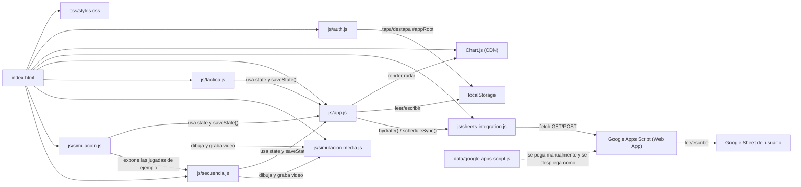

# Arquitectura — DTCommander

DTCommander es una app web estática (sin build, sin backend propio) para
que un DT de fútbol femenino (fútbol 8) evalúe jugadoras por atributos,
siga su progreso en el tiempo (pestaña Jugadora), arme/mueva la
formación del equipo en un campo visual (con un historial de partidos,
cada uno con hasta 3 planes/tableros independientes), dibuje jugadas en
un tablero táctico libre (flechas, lápiz, texto; se guardan con nombre y
se exportan como imagen), simule esas jugadas animadas en fases, con acciones sobre una grilla de
casilleros (avanzar, pase, centro, tiro, gol) y video MP4, o grabe la jugada moviendo las piezas (pestaña Secuencia), y planifique
entrenamientos con una rúbrica de evaluación manual — todo sincronizado
automáticamente contra una Google Sheet.

## Diagrama de módulos

`data/google-apps-script.js` no se sirve junto al resto de la app: es
código fuente que el usuario copia a mano en el editor de Apps Script de
su propia Sheet (ver [SETUP.md](../SETUP.md)) y despliega como "Web App".
Una vez desplegado, esa URL es la única conexión entre el navegador y
Google — no hay ningún servidor intermedio propio.

## Flujo típico de una sesión

0. Se abre `index.html`. Antes que nada, `js/auth.js` decide si mostrar
   `#loginGate` (pantalla de login) o `#appRoot` (la app entera),
   según si ese navegador ya tiene la marca de sesión guardada. Es una
   pantalla disuasoria, no una autenticación real — ver
   [js/auth.md](js/auth.md).
1. Con `#appRoot` visible: `js/app.js` carga el estado desde `localStorage`
   (o crea el estado por defecto con Ine y Agos si es la primera vez).
2. En paralelo, le pide a `js/sheets-integration.js` (`hydrate()`) los
   datos remotos. Si la Sheet responde, esos datos reemplazan al estado
   local; si no (sin configurar, sin red), sigue con lo local.
3. El usuario evalúa jugadoras (pestaña Evaluador, moviendo sliders — eso
   actualiza el valor "actual" pero no queda en el historial hasta que se
   aprieta "Guardar evaluación"), consulta su progreso (pestaña Jugadora,
   de solo lectura), arma la cancha (pestaña Formación: elige un
   partido del historial, un Plan A/B/C dentro de ese partido, y una
   forma táctica dentro de ese plan, y arrastra jugadoras), dibuja una
   jugada en el tablero de la pestaña Táctica (se guarda con nombre y se
   puede exportar como imagen), arma una simulación animada por fases en
   la pestaña Simulación (se descarga como video MP4), o registra
   una rúbrica de entrenamiento por posición (pestaña Entrenamiento —
   queda como historial de referencia, no modifica atributos). Cada
   cambio llama a `saveState()`.
4. `saveState()` escribe siempre en `localStorage` al instante, y avisa a
   `sheets-integration.js` (`scheduleSync()`), que manda el estado
   completo a la Sheet 800ms después del último cambio (debounced).
5. Un indicador en el header (`#syncStatus`) refleja en todo momento si
   se está sincronizado, sincronizando, sin conexión, o sin Sheets
   configurado todavía.

## Otros archivos

- `images/` — assets sueltos (por ejemplo escudos) que el usuario va
  agregando. No hay ningún código que los use todavía; cuando se
  conecte alguno a la UI (por ejemplo como logo del header), se
  documenta acá.

## Índice de módulos

- [index.md](index.md) — estructura HTML
- [css/styles.md](css/styles.md) — estilos
- [js/auth.md](js/auth.md) — pantalla de login (disuasoria, no real)
- [js/app.md](js/app.md) — estado, Evaluador, Jugadora, Formación (drag & drop), Entrenamiento
- [js/simulacion.md](js/simulacion.md) — pestaña Simulación: jugada animada en fases (pelota pegada, notas, tiempos, jugadas de ejemplo), historial y video MP4
- [js/secuencia.md](js/secuencia.md) — pestaña Secuencia: jugada grabada moviendo las piezas (pasos individuales o simultáneos, recorridos numerados, tabla de movimientos), historial y video MP4
- [js/simulacion-media.md](js/simulacion-media.md) — dibujo de la cancha (SVG y canvas) y grabación de video
- [js/tactica.md](js/tactica.md) — pestaña Táctica: tablero libre (jugadoras, rivales, flechas, lápiz, texto), historial de tácticas y exportar imagen
- [js/sheets-integration.md](js/sheets-integration.md) — sync automática con Sheets
- [data/google-apps-script.md](data/google-apps-script.md) — backend en Apps Script

Ver también [GLOSSARY.md](GLOSSARY.md).
