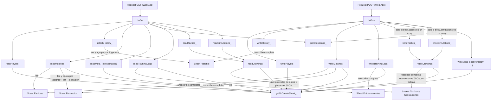

# data/google-apps-script.js

El único backend "real" de la app. No es parte del bundle que sirve
`index.html`: es código que el usuario pega manualmente en el editor de
Apps Script de su propia Google Sheet (ver [SETUP.md](../../SETUP.md)) y
despliega como "Web App". Expone dos funciones que Apps Script invoca
automáticamente según el método HTTP recibido, y persiste la jerarquía
completa Partido → Plan → forma táctica → placements que usa
[js/app.js](../js/app.md).

## Flujo interno

## Esquema de hojas

- **Jugadoras** — `Nombre, Apodo, Edad, Altura, PieDominante,
  PosPrincipal, PosSecundaria, [11 atributos]`. Una fila por jugadora,
  con los valores **actuales** (los que se editan en vivo en Evaluador).
- **Historial** — `Jugadora, Fecha, Etiqueta, [11 atributos]`. Una fila
  por cada evaluación guardada explícitamente (ver
  [[historial de evaluaciones]] en el [Glosario](../../GLOSSARY.md)) —
  no una foto de cada cambio de slider, solo de cuando el DT aprieta
  "Guardar evaluación".
- **Partidos** — `MatchId, Rival, Fecha, ActivePlan, FormacionPlanA,
  FormacionPlanB, FormacionPlanC`. Una fila por partido: guarda el
  rival/fecha (ver [[partido (match)]] en el
  [Glosario](../../GLOSSARY.md)) y qué forma táctica tiene activa cada
  uno de los tres planes.
- **Formacion** — `MatchId, Plan, Formacion, Jugadora, X, Y`. Una fila
  por jugadora ubicada, cruzando partido × plan × forma táctica. Por
  ejemplo, la misma jugadora puede tener una fila en `(m123, Plan A,
  2-3-2)` y otra distinta en `(m123, Plan B, Libre)`.
- **Entrenamientos** — `Fecha, Posicion, Jugadora, tecnica, tactica,
  presion, actitud, fisico, Observaciones`. Una fila por rúbrica
  guardada desde la pestaña Entrenamiento — `Jugadora` puede quedar
  vacía si la evaluación fue grupal. No tiene relación con
  `Jugadoras`/`Historial`: llenar esta rúbrica **no** modifica los
  atributos de nadie, es solo un registro de referencia.
- **Tacticas** — `Id, Nombre, Creada, Actualizada, Eliminada, Datos,
  Datos2, ...`. Una fila por táctica de la pestaña Táctica (ver
  [js/tactica.js](../js/tactica.md)). El dibujo (`items`) va como JSON en
  `Datos`; si supera los 40.000 caracteres se sigue en `Datos2`, `Datos3`...
  porque una celda de Sheets aguanta 50.000. `Eliminada` vale `si` para las
  tácticas borradas (borrado "blando": la fila queda, sin dibujo). Es una
  de las dos hojas (con Simulaciones) que **no** se lee ni se escribe siempre
  entera desde la app: ver más abajo.
- **Simulaciones** — mismo formato que Tacticas (`Id, Nombre, Creada,
  Actualizada, Eliminada, Datos, ...`), para las simulaciones de la pestaña
  Simulación ([js/simulacion.js](../js/simulacion.md)). Su `Datos` es una
  lista plana de items: una fila de tipo `phase` por fase (nombre, nota,
  tiempo y orden de las acciones), las piezas de cada fase, y sus acciones,
  textos y casilleros sombreados. Como el Apps Script solo guarda y devuelve
  esa lista sin mirar su contenido, sumar tipos de item nuevos no obliga a
  volver a pegar el script.
- **Meta** — `Clave, Valor`. Hoy solo guarda `activeMatch` (qué partido
  quedó abierto la última vez).

`ATTRIBUTES`, `PLAN_NAMES` y `RUBRIC_KEYS` en este archivo son copias
manuales de `ATTRIBUTES`, `PLANS` y `RUBRIC_DIMENSIONS` en
[js/app.js](../js/app.md) — si se edita alguno de esos arrays hay que
replicar el cambio acá y volver a implementar (ver
[SETUP.md](../../SETUP.md), sección "Cuándo repetir estos pasos"). Ojo:
las *descripciones* de cada dimensión por posición
(`RUBRIC_LABELS_BY_POSITION` en `js/app.js`) son puramente del lado del
cliente y no viven acá — cambiarlas no requiere tocar este archivo ni
redeployar, solo las 5 keys en sí (`tecnica`, `tactica`, `presion`,
`actitud`, `fisico`) están fijadas en el esquema de la Sheet.

## `doGet(e)` / `doPost(e)`

`doGet` arma `{ players, matches, trainingLogs, tactics, simulations,
activeMatch }` combinando las ocho hojas — `attachHistory_` le agrega el array
`.history` a cada jugadora de `players` antes de responder. `doPost`
recibe ese mismo shape completo (mandado como `text/plain` desde el
cliente para evitar el preflight de CORS — ver [[CORS / preflight]] en
el Glosario) y reescribe **todo** — no hace merge ni upsert parcial:
cada sync es una foto completa del estado actual de la app, para las
hojas de datos (Jugadoras, Historial, Partidos, Formacion,
Entrenamientos, Tacticas, Simulaciones; Meta solo guarda `activeMatch`). La
única excepción son `tactics` y `simulations`: `doPost` las escribe **solo
si** el cuerpo trae un array con ese nombre, así una versión vieja de la app (que no las conoce) no
borra las que ya están en la Sheet.

## Tácticas y Simulaciones: `readDrawings_(sheet)` / `writeDrawings_(sheet, list)` / `asText_(value)`

Las dos hojas comparten el código: `readTactics_`, `writeTactics_`,
`readSimulations_` y `writeSimulations_` son atajos de una línea a estas
dos funciones. `writeDrawings_` serializa cada `items` con `JSON.stringify` y lo reparte en
trozos de `DIBUJOS_CHUNK` (40.000) caracteres, uno por columna, así un
dibujo grande no choca con el límite de una celda; las filas se rellenan
con `''` hasta el mismo ancho y los encabezados se arman según lo que haga
falta (`Datos`, `Datos2`...). Escribe con `setNumberFormat('@')` (texto
plano) para que Sheets no interprete fechas ni fórmulas. `readDrawings_`
hace lo inverso: une todas las celdas desde la sexta columna, parsea el
JSON (si una celda está rota devuelve `items: []` en vez de fallar el
`doGet` entero) y `asText_` convierte a texto cualquier valor que Sheets
haya transformado en `Date`. Ver [[eliminación blanda (soft delete)]] en el
[Glosario](../../GLOSSARY.md).

## `jsonResponse_(obj)` / `getOrCreateSheet_(name, headers)`

Sin cambios: `jsonResponse_` envuelve la respuesta como JSON
(`ContentService`, ver [[ContentService]] en el Glosario);
`getOrCreateSheet_` crea la hoja con sus encabezados la primera vez que
se la pide, así que la primera sincronización crea solas las hojas
`Partidos`/`Formacion`/`Meta` si no existían.

## Jugadoras: `readPlayers_()` / `writePlayers_(players)`

`readPlayers_` arma un mapa `nombre de encabezado → índice de columna`
a partir de la primera fila y busca cada campo por ese nombre (helper
`cell(row, header)`), no por posición fija. Eso permite que una Sheet
con el formato **viejo** (sin `Apodo`/`Edad`/`Altura`/`PieDominante`)
se siga leyendo bien con el código nuevo —los campos que faltan quedan
como `''`— y que el orden de columnas pueda cambiar sin romper la
lectura: entre el momento en que se redeploya el script y la próxima
escritura desde la app (que reescribe la hoja completa en el formato
nuevo), no hay ventana donde los datos se lean corridos de columna.

`writePlayers_` reescribe la hoja entera con `JUGADORAS_HEADERS`
(identidad/texto primero: `JUGADORAS_TEXT_HEADERS`, después los
atributos). Las columnas de texto se escriben con `setNumberFormat('@')`
para que Sheets no "interprete" un apodo tipo `1-2` como fecha; los
atributos quedan numéricos.

## Historial: `attachHistory_(players)` / `writeHistory_(players)`

`attachHistory_` recibe el objeto `players` que ya armó `readPlayers_`
y le agrega, **mutándolo in-place**, un array `.history` a cada
jugadora (vacío si no tiene evaluaciones guardadas), leyendo la hoja
`Historial` y agrupando sus filas por nombre. `writeHistory_` hace lo
inverso: recorre `players[nombre].history` (tal como lo manda el
cliente en el `POST`) y vuelca una fila por cada entrada, para todas
las jugadoras, reescribiendo la hoja completa — mismo patrón de
"foto completa" que `writeMatches_`, y misma razón para el
`setNumberFormat('@')` (las fechas como texto plano, no como objeto
Date de Sheets).

## Partidos + Formación: `readMatches_()` / `writeMatches_(matches)`

- `readMatches_()` arma primero el esqueleto de cada partido leyendo
  `Partidos` (rival, fecha, plan activo, y la forma táctica activa de
  cada uno de los tres planes), y después recorre `Formacion` fila por
  fila para ir completando `matches[matchId].plans[plan]
  .formations[formacion].placements[jugadora]`. Una fila de `Formacion`
  que apunte a un `MatchId` o `Plan` que ya no existe en `Partidos` se
  ignora en silencio (partido borrado del lado del cliente).
- `writeMatches_(matches)` hace el camino inverso: por cada partido
  arma una fila de `Partidos`, y por cada combinación
  partido×plan×forma con jugadoras ubicadas, una fila de `Formacion`.
  Aplica `setNumberFormat('@')` antes de escribir — sin esto, Sheets
  "adivina" que valores como `2-3-2` son una fecha (2 de marzo) y los
  reescribe solo, corrompiendo el dato.

## Entrenamientos: `readTrainingLogs_()` / `writeTrainingLogs_(logs)`

Sin relación con las demás hojas — es una lista plana de registros
(`{ date, position, player, scores, notes }`), no algo indexado por
jugadora. Mismo patrón de "foto completa" y `setNumberFormat('@')` que
el resto: `readTrainingLogs_` ignora filas sin `Posicion` (fila vacía),
`writeTrainingLogs_` reescribe la hoja entera a partir del array
`trainingLogs` que manda el cliente.

## Meta: `readMeta_(key)` / `writeMeta_(key, value)`

Sin cambios de mecánica (clave/valor simple), solo que ahora la única
clave usada es `activeMatch` — el `activeFormation` de antes pasó a
vivir dentro de cada fila de `Partidos` (una columna por Plan), porque
ahora hay tres formas activas a la vez (una por plan) en vez de una
sola global.

## Dependencias externas

| Dependencia | Uso |
|---|---|
| `SpreadsheetApp` (API de Google Apps Script) | Leer/escribir las hojas del spreadsheet |
| `ContentService` (API de Google Apps Script) | Construir la respuesta HTTP en JSON |
| [js/sheets-integration.js](../js/sheets-integration.md) | Único cliente HTTP que llama a este script |

Ver también [GLOSSARY.md](../GLOSSARY.md).
