# index.html

El único documento HTML de la app: define la estructura (header, seis
pestañas, formularios) que [js/app.js](js/app.md) rellena y manipula. No
tiene lógica propia — es puro esqueleto con IDs y clases que el
JavaScript busca por `document.getElementById` / `querySelectorAll`.

## Secciones y a qué IDs se engancha el JS

```mermaid
flowchart TD
    LoginGate["#loginGate / #appRoot"] --> AuthJS["js/auth.js"]

    Header["header (#syncStatus, #logoutBtn)"] --> SheetsIntegration["js/sheets-integration.js: setStatus()"]
    Header --> AuthJS

    TabsNav[".tab-btn (Evaluador / Jugadora / Formación / Táctica / Simulación / Entrenamiento)"] --> AppTabs["js/app.js: setupTabs()"]

    PanelEvaluador["#panel-evaluador"] --> PlayerSelect["#playerSelect"]
    PanelEvaluador --> AddRemove["#addPlayerBtn / #addPlayerForm / #removePlayerBtn"]
    PanelEvaluador --> PlayerData["#playerApodo / #playerEdad / #playerAltura / #playerPieDominante / #posPrincipal / #posSecundaria"]
    PanelEvaluador --> AttrsChart[".attrs-chart-layout (grid 2 columnas)"]
    AttrsChart --> Sliders["#slidersContainer (vacío, se llena por JS)"]
    AttrsChart --> Radar["#radarChart (canvas)"]
    PanelEvaluador --> SaveEval["#saveEvalBtn / #saveEvalForm"]
    PanelEvaluador --> ExportBtn["#exportCsvBtn"]

    PanelJugadora["#panel-jugadora"] --> DashSelect["#dashboardPlayerSelect"]
    PanelJugadora --> DashInfo["#dashboardInfoCard / #dashboardPlayerInfo (datos básicos, solo lectura)"]
    PanelJugadora --> DashLayout[".attrs-chart-layout (grid 2 columnas)"]
    DashLayout --> DashAttrs["#dashboardAttrsGrid + #attrColorLegend"]
    DashLayout --> DashRadar["#dashboardRadarChart (canvas)"]
    PanelJugadora --> DashDiff["#dashboardDiff (debajo del layout, ancho completo)"]
    PanelJugadora --> DashTrend["#dashboardTrendChart (canvas, dentro de .chart-wrap)"]
    PanelJugadora --> DashTimeline["#dashboardTimeline"]

    PanelFormacion["#panel-formacion"] --> MatchControls["#matchSelect / #addMatchForm / #removeMatchBtn"]
    PanelFormacion --> PlanTabs["#planTabs (Plan A/B/C)"]
    PanelFormacion --> FormationSelect["#formationSelect"]
    PanelFormacion --> ResetBtn["#resetFormationBtn"]
    PanelFormacion --> Available["#availablePlayers"]
    PanelFormacion --> Suggestions["#suggestions / #suggestionsList"]
    PanelFormacion --> Field["#field (svg, viewBox 0 0 300 400)"]

    PanelTactica["#panel-tactica"] --> TacticControls["#tacticSelect / #newTacticBtn / #removeTacticBtn / #tacticConfirm"]
    PanelTactica --> TacticSave["#tacticName / #saveTacticBtn / #saveTacticCopyBtn / #exportTacticBtn"]
    PanelTactica --> TacticToolbar["#tacticTools / #tacticPalette / #tacticDash / #tacticTextRow / #tacticUndo"]
    PanelTactica --> TacticPlayers["#tacticPlayers / #addRivalBtn / #importFormationBtn"]
    PanelTactica --> TacticField["#tacticField (svg, lo dibuja el JS)"]

    PanelSimulacion["#panel-simulacion"] --> SimControls["#simSelect / #newSimBtn / #removeSimBtn / #simConfirm"]
    PanelSimulacion --> SimSave["#simName / #saveSimBtn / #saveSimCopyBtn / #exportVideoBtn"]
    PanelSimulacion --> SimStart["#simTemplate / #useTemplateBtn / #simFromTactic / #useTacticBtn"]
    PanelSimulacion --> SimPlayers["#simPlayers / #addSimRivalBtn / #addSimBallBtn / #simAssignBtn"]
    PanelSimulacion --> SimField["#simField (svg, lo dibuja el JS)"]
    PanelSimulacion --> SimPhases["#simPhaseTabs / #addPhaseBtn / #phaseName / #phaseNote / #phaseDur"]
    PanelSimulacion --> SimPlay["#simPlayBtn / #simScrubber / #simSpeed / #simLoop / #simAuto / #simCaption"]

    PanelEntrenamiento["#panel-entrenamiento"] --> TrainingTabs["#trainingPositionTabs"]
    PanelEntrenamiento --> TrainingSuggestions["#trainingSuggestions"]
    PanelEntrenamiento --> RubricForm["#openRubricBtn / #rubricForm / #rubricCriteria"]
    PanelEntrenamiento --> TrainingLog["#trainingLogList"]
```

## Notas de estructura

- **`#loginGate`** / **`#appRoot`**: son dos contenedores hermanos, no
  anidados. `#appRoot` arranca con `hidden` puesto directamente en el
  HTML (no por JS) para que no haya un instante de "flash" de la app
  antes de que [js/auth.js](js/auth.md) decida si mostrarla. Todo lo
  que describe el resto de este documento (header, tabs, las seis
  pestañas) vive **dentro** de `#appRoot`.
- **`#syncStatus`**: un punto (`●`) en el header cuyo color y `title`
  controla por completo [js/sheets-integration.js](js/sheets-integration.md)
  — el HTML solo define el estado inicial (`sync-local`).
- **`#slidersContainer`** y las opciones de `#posPrincipal` /
  `#posSecundaria` arrancan vacíos a propósito: `app.js` los genera desde
  `ATTRIBUTES` y `POSITIONS` para que agregar un atributo o una posición
  nueva no requiera tocar este archivo.
- **`#field`** es un `<svg>` con el fondo de la cancha dibujado a mano
  (rectángulos y círculos con clases CSS), sobre el que `app.js` agrega y
  quita dinámicamente los `<g class="player-token">` de cada jugadora
  ubicada.
- **`#matchSelect`** y **`#planTabs`** son los dos niveles por encima de
  la forma táctica: primero se elige el partido (rival + fecha, ver
  [[partido (match)]] en el [Glosario](GLOSSARY.md)), después el
  [[plan (Plan A / Plan B / Plan C)]]. `#addMatchForm` sigue el mismo
  patrón inline que `#addPlayerForm` (sin `prompt()` del navegador).
- **`#suggestions`** arranca oculto (`hidden`) y solo se muestra al pasar
  el mouse por una jugadora en la cancha. Contiene su gráfico de estrella
  (`#suggestionsRadar`) y la lista de alternativas (`#suggestionsList`) —
  ver `showSuggestions()` en [js/app.js](js/app.md).
- **`#saveEvalForm`** (mismo patrón inline que `#addPlayerForm`) es el
  único lugar que agrega un punto al
  [[historial de evaluaciones]] de una jugadora — ver el
  [Glosario](GLOSSARY.md). El panel `#panel-jugadora` que lo consume es
  de solo lectura: no tiene ningún input, solo `#dashboardPlayerSelect`
  para elegir a quién mirar.
- **`#dashboardTrendChart`** está envuelto en un `
`
  con alto fijo (ver [css/styles.md](css/styles.md)) — un `<canvas>` de
  Chart.js suelto dentro de un contenedor flex/grid sin alto definido se
  estira sin control, por eso el resto de los `<canvas>` de la app usan
  atributos `width`/`height` fijos en vez de este wrapper.
- **`#rubricForm`** (pestaña Entrenamiento) sigue el mismo patrón inline
  que `#addPlayerForm`/`#addMatchForm`/`#saveEvalForm`: arranca oculto y
  se completa desde JS. Guardarlo agrega una entrada a
  `state.trainingLogs` — nunca toca `state.players` (ver
  [[rúbrica de entrenamiento]] en el [Glosario](GLOSSARY.md)).
- Ojo con cualquier elemento `hidden` nuevo: si su clase define
  `display` (flex/grid/block), esa regla de autor le gana al `display:
  none` por defecto del navegador para `[hidden]`. Por eso
  [css/styles.css](css/styles.css) tiene una regla global
  `[hidden] { display: none !important; }` cerca del principio — sin
  ella, los formularios de arriba quedaban siempre visibles aunque el
  atributo `hidden` estuviera bien puesto (bug real que hubo en la app).
- Carga siete `<script>` al final del `<body>`, en este orden:
  `auth.js`, Chart.js (CDN), `sheets-integration.js`, `app.js`, `tactica.js`,
  `simulacion-media.js`, `simulacion.js`.
  `auth.js` va primero porque decide si el resto siquiera se ve; el
  resto del orden importa porque `app.js` usa `window.SheetsSync` y
  `Chart` al arrancar. `tactica.js` va después de `app.js` porque usa sus
  funciones y su estado, y `app.js` lo invoca con un `typeof` de por medio. Lo mismo con
  `simulacion.js`, que además necesita `simulacion-media.js` ya cargado
  (usa `window.SimMedia` apenas arranca).
- **`#tacticField`** es un `<svg>` vacío (solo el `viewBox`): la cancha, las
  jugadoras y los dibujos los crea [js/tactica.js](js/tactica.md). La
  barra de herramientas (`.tactic-tools-card`) queda fija arriba en
  celulares (`position: sticky`). `#tacticTextRow` (el cuadro para
  escribir texto) arranca `hidden` y solo se muestra con la herramienta
  Texto o con un texto seleccionado. `#tacticConfirm` es la barra inline
  "cambios sin guardar" (mismo patrón que los otros formularios inline).
- **`#simField`** también es un `<svg>` vacío que dibuja el JS
  ([js/simulacion.js](js/simulacion.md)). Debajo, el panel de fases:
  `#simPhaseTabs` (una pestaña por fase, que se desliza de costado),
  nombre, nota y tiempo de la fase actual, y los controles de reproducción.
  `#simSelBar` (acciones sobre la ficha seleccionada) y `#simCaption` (texto
  de la fase mientras se reproduce) arrancan `hidden`. `#simAssignBtn`
  aparece solo cuando hay puestos de una jugada de ejemplo sin jugadora.
  Con la clase `sim-playing` en `#panel-simulacion` la lista de jugadoras
  queda deshabilitada.

## Dependencias externas

| Dependencia | Uso |
|---|---|
| [css/styles.css](css/styles.md) | Todo el estilo visual |
| [js/auth.md](js/auth.md) | Pantalla de login (disuasoria, no real) |
| [Chart.js](https://www.chartjs.org/) (CDN `jsdelivr`) | Radar chart de atributos |
| [js/sheets-integration.js](js/sheets-integration.md) | Sync con Google Sheets |
| [js/app.js](js/app.md) | Estado, Evaluador, Jugadora, Formación y Entrenamiento |
| [js/tactica.js](js/tactica.md) | Pestaña Táctica (tablero libre) |
| [js/simulacion.js](js/simulacion.md) | Pestaña Simulación (jugada animada en fases) |
| [js/simulacion-media.js](js/simulacion-media.md) | Dibujo (SVG y canvas) y grabación de video |

Ver también [GLOSSARY.md](GLOSSARY.md).
