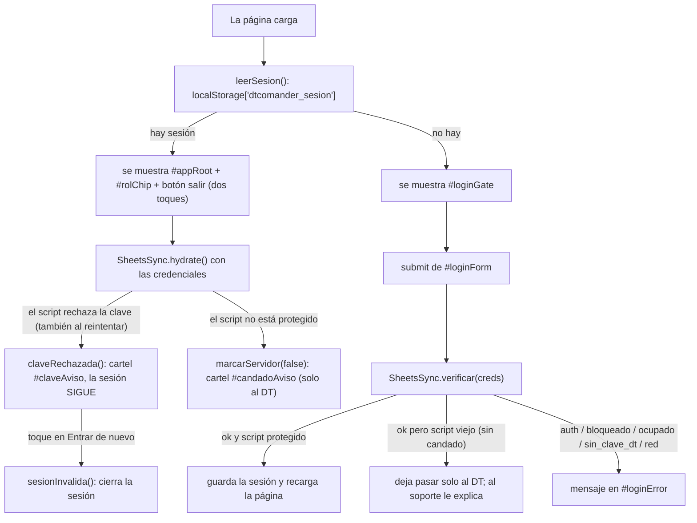

# js/acceso.js

Quién entró a la app y qué puede hacer. Reemplaza al `auth.js` de antes, que era una "cortina" con el mail y la
contraseña escritos en el código público. Acá **no hay ninguna clave escrita**: cada persona escribe la suya, se la
manda al Apps Script y es el Apps Script el que decide (ver "Acceso y permisos" en
[data/google-apps-script.js](../data/google-apps-script.md)). Se carga **primero** en [index.html](../index.md),
antes que `sheets-integration.js` y `app.js`, porque `app.js` necesita saber quién entró apenas arranca.

Lo que se oculta en la pantalla sirve para no confundir, pero **lo que protege los datos es el script**: entrega a
cada rol solo lo que le corresponde y solo deja escribir al DT y al soporte.

## Roles

| Rol | Entra con | Puede |
|---|---|---|
| `dt` | la clave larga guardada en las Propiedades del script (`DT_KEY`) | ver y editar todo |
| `soporte` | su nombre + una clave larga que genera el DT | ver y editar todo menos los accesos |
| `jugadora` | su nombre + un PIN de 4 dígitos | solo leer lo que le corresponde (su vista todavía no está lista, por eso hoy no aparece en la pantalla de entrada: `ROLES_HABILITADOS`) |

## Flujo

## Permisos por rol: `PERMISOS`

Una sola tabla con lo que puede hacer cada rol en cada solapa: `editar` (ve y edita), `ver` (solo mira) o `nada`. La usa
la pestaña Permisos de [Ajustes](ajustes.md) y la usará la vista de solo lectura de las jugadoras. Lo que de verdad se
entrega o se acepta lo decide el Apps Script; esta tabla lo dice en pantalla.

## `window.Acceso`

- **`rol`**, **`nombre`**: los de la sesión (o `null`/`''` si no hay).
- **`credenciales()`**: `{ rol, nombre, clave }` para mandar en cada pedido al script.
- **`PERMISOS`** y **`nivel(panel)`**: la tabla de arriba y el nivel del rol actual en una solapa (`'ajustes'` incluida). El
  engranaje ⚙ del encabezado solo se muestra si `nivel('ajustes')` es `editar` (o sea, para el DT).
- **`puedeEditar()`**: `true` para `dt` y `soporte`. La sincronización lo usa para **no mandar nunca una escritura**
  desde una jugadora (segunda barrera; la primera es que el script las rechaza).
- **`storageKey()`**: dónde guarda `app.js` los datos en el dispositivo. El DT y el soporte usan `dtcomander_data`;
  las jugadoras, `dtcomander_data_jugadora`, aparte, para que un celular compartido no mezcle lo de una con lo del DT.
  Al salir una jugadora se borra su espacio, y al entrar el DT o el soporte también.
- **`marcarServidor(protegido)`**: la sincronización avisa si el script está protegido. Un script viejo (sin
  candado) no lo está: al DT se le muestra `#candadoAviso` con lo que tiene que hacer.
- **`claveRechazada()` / `claveAceptada()`**: si el script no acepta la clave guardada (por ejemplo, cambiaron `DT_KEY`),
  incluso después de reintentar, se muestra el cartel `#claveAviso` con el botón "Entrar de nuevo". **La sesión no se cierra
  sola**: antes sí se cerraba al primer rechazo, y eso podía dejar al DT afuera en plena cancha, sin señal para volver a
  entrar, por un rechazo aislado. Con el cartel se puede seguir trabajando (queda guardado en el dispositivo) y el cartel se
  esconde solo si un pedido posterior sale bien.
- **`sesionInvalida()`**: es lo que hace el botón "Entrar de nuevo": cierra la sesión y la entrada muestra "Ingresá de nuevo
  con tu clave" (el aviso pasa por `sessionStorage`, porque la página se recarga).
- **`registrar(tipo, ms, resultado, nota)`**, **`diagnostico()`**, **`borrarDiagnostico()`**: el historial de conexión de este
  dispositivo (`localStorage['dtcomander_diag']`, los últimos 30 pedidos: entrar, cargar datos y guardar, con lo que tardaron
  y cómo salieron; **sin claves**). Se ve en [Ajustes → Conexión](ajustes.md).
- Al entrar, si Google tarda más de 3 segundos el botón pasa a "Verificando con Google… puede tardar".
- **`cerrarSesion()`**: borra la sesión y recarga.

## Detalles que importan

- **Entrar y salir recargan la página.** `app.js` decide sus datos al cargarse (por `storageKey()`), así que cambiar de
  persona es empezar de cero. Es simple y evita mezclar datos.
- **El botón ⏻ pide dos toques** ("¿Salir?"): salir sin querer en la cancha, sin señal, dejaría afuera al DT porque
  entrar la primera vez necesita internet. Con la sesión ya guardada, la app abre sin conexión.
- **Con el script viejo no hay cómo comprobar una clave**, así que solo se deja pasar al DT (que además ve el cartel).
  Al soporte y a las jugadoras se les explica que el candado todavía no está activado: si no, recibirían datos sin filtrar.
- **El nombre del soporte y de las jugadoras se muestra con `textContent`**, nunca como HTML.
- Los mensajes de error no distinguen "nombre que no existe" de "clave equivocada".

## Dependencias externas

| Dependencia | Uso |
|---|---|
| `localStorage` / `sessionStorage` (API del navegador) | Recordar la sesión en ese dispositivo y pasar el aviso de "clave inválida" entre recargas |
| [js/sheets-integration.js](sheets-integration.md) | `verificar()` para comprobar las credenciales contra el script |
| [js/app.js](app.md) | Usa `Acceso.storageKey()` para su `STORAGE_KEY` |

Ver también [GLOSSARY.md](../GLOSSARY.md).
