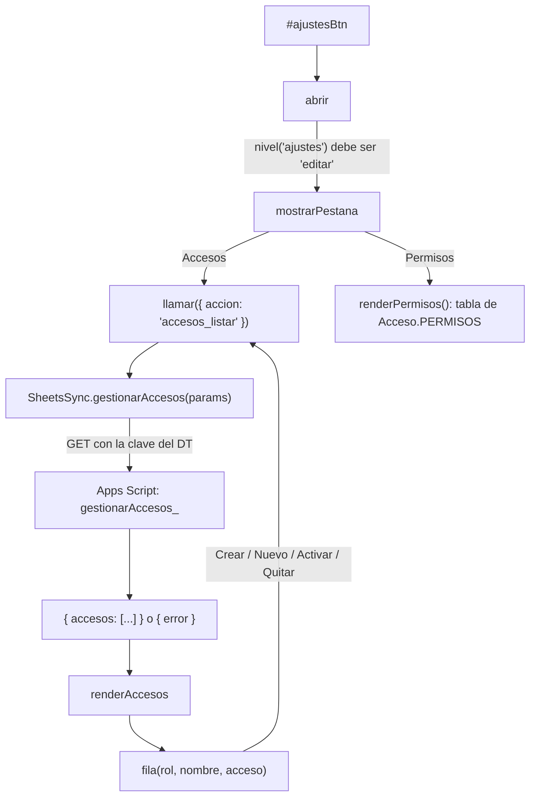

# js/ajustes.js

El panel de **Ajustes** (el engranaje del encabezado), que solo ve el DT: administrar los accesos de las jugadoras y del
equipo técnico, leer la política de datos y ver la tabla de permisos. Es un diálogo que se abre encima de la app, no una
solapa. Se carga al final, después de `jugados.js`, y usa `window.Acceso` ([acceso.md](acceso.md)),
`window.SheetsSync` ([sheets-integration.md](sheets-integration.md)) y el `state` de [app.js](app.md) (solo para
conocer los nombres del plantel).

## Qué hay adentro

- **Accesos**: una fila por jugadora del plantel (más las filas de accesos de alguien que ya no está en el plantel, con
  el aviso "Ya no está en el plantel", para poder quitarlas) y una fila por persona del equipo técnico.
  - Sin acceso: **Crear PIN** (jugadora) o **Crear clave** (soporte).
  - Con acceso: **Mostrar/Ocultar** la clave (empieza tapada), **Copiar**, **Nuevo PIN / Nueva clave**,
    **Desactivar/Activar** y **Quitar**. Cambiar la clave y quitar piden dos toques (el botón pasa a "¿Cambiar?" o
    "¿Quitar?" durante 4 segundos): no se usan diálogos del navegador.
  - Debajo, un formulario para agregar a alguien del equipo técnico; su clave larga queda a la vista para copiarla.
- **Política de datos**: texto fijo (un borrador en español: qué se guarda, dónde, quién ve qué, claves, buenas
  prácticas, conservación y borrado). Dice que no es asesoramiento legal y menciona la Ley 25.326 de Protección de los
  Datos Personales (Argentina).
- **Conexión**: el historial que guarda este dispositivo (`Acceso.diagnostico()`): una tabla con hora, pedido (entrar, cargar
  datos, guardar), cuánto tardó y cómo salió, y un resumen ("Cargar los datos tardó en promedio X s… El script rechazó la
  clave N veces"). Sirve para saber si una demora es de Google o de la app, y para ver si el script rechaza la clave de vez en
  cuando. El botón "Borrar historial" lo vacía. No contiene claves.
- **Permisos**: la tabla de `Acceso.PERMISOS` (solapa × rol: "Ve y edita", "Solo ve" o "Sin acceso"). Por ahora los roles
  son fijos.

## Cómo funciona

- **`llamar(params)`**: manda una acción y redibuja con la lista que devuelve el script (siempre completa y al día). Mientras
  espera, los botones quedan deshabilitados y se avisa "Cargando accesos…". Si algo falla muestra el motivo en
  `#ajustesError`. Con un script viejo (sin candado) dice que el candado no está activado y **no dibuja una lista falsa**.
- **Las claves no se guardan en el dispositivo ni en `state`**: la lista vive en memoria mientras el panel está abierto y se
  descarta al cerrarlo (las claves vuelven a quedar tapadas).
- **Todo lo que viene de la Sheet se dibuja con `textContent`**, nunca como HTML, así que un nombre con etiquetas no
  ejecuta nada.
- **Teclado**: al abrir, el foco va al botón de cerrar; Esc o un clic afuera cierran y devuelven el foco al engranaje; Tab
  no sale del panel; al redibujar una fila el foco vuelve a esa fila.
- En pantallas de hasta 640 px el panel ocupa toda la pantalla; la tabla de permisos se desplaza dentro de su caja.

## Dependencias externas

| Dependencia | Uso |
|---|---|
| [js/acceso.js](acceso.md) | `Acceso.nivel('ajustes')` para saber si mostrarse y `Acceso.PERMISOS` para la tabla |
| [js/sheets-integration.js](sheets-integration.md) | `SheetsSync.gestionarAccesos()` |
| [js/app.js](app.md) | El `state` del plantel |
| `navigator.clipboard` (API del navegador) | El botón Copiar |

Ver también [GLOSSARY.md](../GLOSSARY.md).
