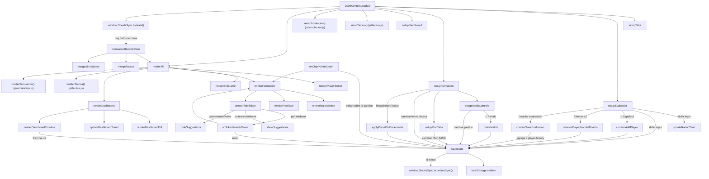

# js/app.js

Es el cerebro de la aplicación: define la configuración editable (atributos,
posiciones, formaciones, planes, sugerencias y rúbrica de entrenamiento),
guarda todo el estado en memoria y en `localStorage`, y renderiza las
cuatro pestañas propias (Táctica y Simulación viven en
[js/tactica.js](tactica.md) y [js/simulacion.js](simulacion.md)): Evaluador (sliders + radar chart, uno al lado del otro),
Jugadora (dashboard de solo lectura con el progreso en el tiempo),
Formación (historial de Partidos → Plan A/B/C → forma táctica → campo SVG
con arrastrar-y-soltar y sugerencias de alternativas) y Entrenamiento
(sugerencias por posición + rúbrica manual, sin tocar atributos).

## Jerarquía de datos en Formación

```
state.matches[matchId]              // un partido: rival + fecha
  .plans['Plan A' | 'Plan B' | 'Plan C']   // tablero independiente
    .formations['2-3-2' | '3-2-2' | '2-2-3' | 'Libre']
      .placements[jugadora] = {x, y}
```

`state.activeMatch` guarda qué partido está abierto; cada partido guarda
en `activePlan` qué Plan está abierto; cada plan guarda en
`activeFormation` qué forma táctica está abierta. Ver [[partido (match)]]
y [[plan (Plan A / Plan B / Plan C)]] en el [Glosario](../GLOSSARY.md).

## Flujo interno



## Configuración editable (constantes)

- **`ATTRIBUTES`** — array con los once atributos evaluables (se guardan
  de 0,1 a 10 en pasos de 0,1; se muestran ×10, ver `SCORE_SCALE`). Agregar o sacar uno acá actualiza automáticamente
  sliders, radar chart y CSV; hay que replicarlo a mano en
  [data/google-apps-script.js](../data/google-apps-script.md).
- **`POSITIONS`** — catálogo de puestos (`Arquera`, `Defensa`,
  `Mediocampo`, `Delantera`) usado en los selects de posición principal y
  secundaria del Evaluador, y para calcular sugerencias en Formación.
- **`POSITION_KEY_ATTRS`** / **`OFF_POSITION_WEIGHT`** — los 5 atributos
  principales de cada puesto y cuánto pesan los demás (0,5) en el promedio de
  la jugadora; ver `average` en la solapa Jugadora. Si se agrega un puesto a
  `POSITIONS`, hay que sumarlo también acá (sin entrada, ese puesto usa el
  promedio general).
- **`FORMATION_PRESETS`** — coordenadas por defecto de cada slot para las
  tres formaciones tácticas (`2-3-2`, `3-2-2`, `2-2-3`), más una cuarta
  entrada `'Libre'` con array vacío: no tiene posiciones por defecto, así
  que arranca con todas las jugadoras en "Disponibles" y se arma
  completamente a mano. Cualquier clave cuyo preset esté vacío se trata
  como "formación libre" (ver `isFree` en `renderFormacion()`).
- **`PLANS`** — `['Plan A', 'Plan B', 'Plan C']`, los tres tableros
  independientes que tiene cada partido.
- **`DEFAULT_PLAYERS`**, **`STORAGE_KEY`**, **`FIELD_BOUNDS`** — plantel
  inicial, clave de `localStorage`, y límites válidos de coordenadas
  dentro del `viewBox` del SVG (10–290 x, 10–390 y).

## Estado

### `emptyAttrs()` / `makeEmptyPlayer()` / `formatAttrValue(value)`

`emptyAttrs()` da los once atributos en `5` (valor neutro).
`makeEmptyPlayer()` arma el objeto completo de una jugadora nueva
(`attrs`, `posPrincipal`, `posSecundaria`, los datos básicos `apodo` /
`edad` / `altura` / `pieDominante` —todos `''`— e `history: []`); lo
usan tanto `defaultState()` como el alta manual con "+ Jugadora", para
que la forma del objeto viva en un solo lugar. Como las jugadoras que
vienen de la Sheet pueden no traer los campos nuevos (datos cargados
antes de que existieran), todo el código que los lee usa `|| ''` en
vez de asumir que están.

### Tácticas: `state.tactics` / `sanitizeTacticItems` / `sanitizeTactic` / `sanitizeTactics` / `mergeTactics`

`state` ahora tiene una quinta clave, `tactics`: la lista de tácticas
guardadas de la pestaña Táctica (`{ id, name, createdAt, updatedAt,
deleted, items[] }`; el detalle de los `items` está en
[js/tactica.js](tactica.md)). La UI vive en ese archivo; acá queda solo la
capa de datos, para que la sincronización siga funcionando aunque el
tablero no cargara.

- **`sanitizeTacticItems(items)` / `sanitizeTactic(raw)` /
  `sanitizeTactics(list)`**: todo lo que llega de afuera (`localStorage`
  o la Sheet) pasa por acá. Descartan elementos con tipo desconocido o
  números inválidos, recortan textos y validan el color (`#rgb`...), así un
  dato roto se ignora en vez de romper el tablero. `deleted` acepta
  `true`, `'true'` o `'si'` (así lo guarda la Sheet).
- **`mergeById(local, remote, sanitizeList)`** (y su atajo
  **`mergeTactics(local, remote)`**): une ambas listas elemento por
  elemento y gana la de `updatedAt` más nuevo (ver
  [[eliminación blanda (soft delete)]]). Es la excepción a la regla del
  resto del estado ("si la Sheet tiene datos, pisa lo local"), porque acá
  pisar perdería trabajo: una táctica hecha sin conexión, o antes de
  actualizar el Apps Script (que hasta entonces ni devuelve `tactics`).
  `normalizeRemoteState` la usa con `state.tactics` (todavía el local, ya
  que el reemplazo ocurre después de devolver).
- `defaultState()` arranca con `tactics: []` y `loadLocal()` sanea las
  que haya en `localStorage`, así un estado guardado antes de existir la
  pestaña carga igual.

### Simulaciones: `state.simulations` / `sanitizeSimItems` / `sanitizeSimulation(s)` / `mergeSimulations`

La sexta clave de `state`: las simulaciones de la pestaña Simulación (una
jugada animada en fases; la UI vive en [js/simulacion.js](simulacion.md)).
Mismo esquema que las tácticas (`{ id, name, createdAt, updatedAt, deleted,
items[] }`) y mismos mecanismos: `sanitizeSimulations` limpia todo lo que
llega de afuera y `mergeSimulations` (que usa `mergeById`) une lo local con
la Sheet por `updatedAt`, con borrado "blando".

Los `items` son una lista plana con nueve tipos (los últimos tres son de la solapa Secuencia archivada, abajo): `phase` (una por fase:
`ph`, `name`, `note` y `dur` en segundos, entre 0,5 y 6); `player`,
`rival` y `ball` (con su fase `ph` y, la pelota, `carrier`: quién la lleva);
`text` (cuadro de texto en una fase); y `zone` (casillero sombreado: columna
`zc` 0-2, fila `zr` 1-4).
`sanitizeSimItems` acepta solo los tipos de `SIM_ITEM_TYPES` (un item `action`
de una versión anterior, cuando Simulación tenía acciones de transición, se
descarta al leer), deja el número de fase entre 0 y `MAX_SIM_PHASES - 1`
(12 fases), descarta casilleros fuera de la grilla, valida los colores y
descarta lo inválido. La lista plana permite guardar todo en el mismo formato
de hoja que las tácticas, sin cambiar el Apps Script.

La solapa Secuencia se archivó (ver [archivo/secuencia](../../archivo/secuencia/LEEME.md)), pero
las secuencias que ya se habían guardado siguen en esta misma lista con su
modelo: un item `seq` (la marca), `step` (`ph` = número de paso, `dur` de 0,3 a
8 s) y `move` (`piece`, `path` con hasta 300 puntos, `kind` entre
`SIM_MOVE_KINDS`, `to`, `text`). El número de paso llega a `MAX_SIM_STEPS`
(40). Un `move` sin camino válido se descarta y los puntos inválidos de un
camino se quitan. Se siguen aceptando y sincronizando para que no se pierdan
de la Sheet, aunque ninguna solapa las muestre.

### `SCORE_SCALE` / `toScore(raw)` / `formatScore(score)` / `formatAttrValue(raw)`

Los atributos se **guardan** de 1 a 10 (así están en `localStorage`, en
el `POST` y en la Sheet, y así son comparables con el cuestionario de
autoevaluación) pero se **muestran** de 1 a 100: `SCORE_SCALE = 10` es
el único lugar donde vive esa conversión. `toScore(raw)` multiplica y
redondea a un decimal (evita ruido de coma flotante tipo
`73.00000000000001` en los promedios); `formatScore(score)` formatea un
número que **ya** está en escala 1-100 (entero, o un decimal con coma:
`52,7`); `formatAttrValue(raw)` es `formatScore(toScore(raw))` y es lo que
usan sliders, lista de atributos, diferencias y promedios. La regla para
no convertir dos veces: todo lo que se calcula sobre datos (promedios,
`colorForAttrValue`, cortes de color) trabaja con el valor guardado, y
la conversión se hace recién al dibujar. Los sliders trabajan con el
valor guardado (de 0,1 a 10) pero con paso `1 / SCORE_SCALE` = 0,1, o
sea saltos de 1 punto en la escala que se ve (1, 2, 3…) y mínimo 1; el
número que se ve al lado es solo la etiqueta. Un valor guardado antes
con pasos de 0,5 (como 4,5) carga exacto, sin que el slider lo ajuste. Los gráficos de radar y de
tendencia pasan los datos por `toScore` y tienen eje hasta
`10 * SCORE_SCALE`. El export a CSV sale en la escala 1-100 (la que se
ve en la app), no en la guardada.

`PIE_DOMINANTE_OPTIONS` (`Derecho` / `Izquierdo` / `Ambos`) es el
catálogo del select de pie dominante, mismo patrón que `POSITIONS`.

### `todayISO()` / `formatDateDisplay(iso)` / `matchLabel(match)`

Helpers de fecha: `todayISO()` da la fecha de hoy en formato
`YYYY-MM-DD` (el mismo que usa `<input type="date">`).
`formatDateDisplay()` la pasa a `DD/MM/YYYY` para mostrar.
`matchLabel(match)` arma el texto de una opción del selector de
partidos, por ejemplo `"vs Boca — 01/10/2026"` o `"Partido sin rival —
19/09/2026"` si todavía no se cargó el rival.

### `applyPresetToPlacements(formationName, playerNames)`

Toma el array de slots de `FORMATION_PRESETS[formationName]` y una lista
de nombres, y devuelve un objeto `placements` asignando cada jugadora al
slot en el mismo orden de índice.

### `makeEmptyPlan()` / `makeMatch(rival, date)`

`makeEmptyPlan()` arma un plan nuevo con las 4 formas tácticas
completamente vacías (como "Libre"), a propósito: con un plantel grande,
autocompletar 2-3-2 al crear un partido dejaba a la mayoría de las
jugadoras ya ubicadas sin que el DT hiciera nada, y las que quedaban
"Disponibles" eran solo 2-3. El DT arma cada plan a mano arrastrando, o
usa "Restablecer a preset" si quiere el autocompletado para esa forma
puntual. `makeMatch()` arma un partido nuevo con sus tres planes
(`PLANS.forEach`), todos vacíos por igual.

### `defaultState()`

Construye el estado inicial cuando no hay nada en `localStorage` ni en la
Sheet: crea `Ine` y `Agos`, un primer partido (`makeMatch`) sin rival con
la fecha de hoy, y — solo en este caso puntual de demo con plantel
chico — deja el Plan A ya armado en 2-3-2 vía `applyPresetToPlacements`,
para que la primera vez que se abre la app ya se vea algo en la cancha.

### `loadLocal()` / `saveState()`

`loadLocal()` lee y parsea `localStorage[STORAGE_KEY]` (`null` si no hay
nada o falla, p. ej. en navegación privada). `saveState()` es el único
punto de escritura de estado: guarda en `localStorage` y, si
`window.SheetsSync` está disponible (lo expone
[js/sheets-integration.js](sheets-integration.md)), le pasa el estado
completo para sincronizar en segundo plano.

### `currentMatch()` / `currentPlan()` / `removePlayerFromAllBoards(name)`

Accesores cortos para no repetir `state.matches[state.activeMatch]` en
todos lados: `currentMatch()` devuelve el partido activo, `currentPlan()`
el plan activo dentro de ese partido. `removePlayerFromAllBoards()`
recorre **todos** los partidos, planes y formas tácticas para sacar a una
jugadora eliminada de cualquier cancha donde estuviera ubicada.

### `normalizeRemoteState(remote)`

Adapta la respuesta de `hydrate()` a la forma que espera la app,
garantizando que cada partido remoto tenga sus 3 planes y sus 4 formas
tácticas aunque la Sheet no tuviera datos para alguna (evita `undefined`
si se agregó un Plan o una forma nueva después de que ese partido ya
existía). Si no hay ningún partido remoto, crea uno vacío para no dejar
la pestaña Formación sin nada que mostrar.

## Tabs

### `setupTabs()`

Cablea los botones `.tab-btn` (Evaluador / Jugadora / Formación /
Táctica / Simulación / Entrenamiento, la navegación de más arriba — no confundir con
las solapas de Plan A/B/C, que son internas a Formación). Al pasar a
Táctica o Simulación llama a `renderTactica()` / `renderSimulacion()`, y al elegir cualquier solapa la deja
visible con `scrollIntoView` (con 6 solapas la barra se desplaza a los
costados en pantallas de celular).

## Evaluador

### `setupEvaluador()`

Registra todos los listeners de la pestaña: cambio de jugadora
seleccionada, alta y baja de jugadora, cambio de posición
principal/secundaria, exportar CSV, y genera dinámicamente un
`slider-group` por cada atributo de `ATTRIBUTES`.

**Alta de jugadora**: no usa `prompt()` — el botón "+ Jugadora" muestra
un formulario inline (`#addPlayerForm`, oculto por defecto vía el
atributo `hidden`) con un input de texto y un botón "Agregar".
`confirmAddPlayer()` valida el nombre (no vacío, no duplicado — el
error se muestra en `#addPlayerError`, sin usar `alert()`) y crea la
jugadora. Se evitan a propósito los diálogos nativos del navegador
(`prompt`/`alert`/`confirm`) porque quedan bloqueados o no se muestran
dentro de vistas embebidas como el preview de VS Code.

**Baja de jugadora**: en vez de `confirm()`, el botón "Eliminar" queda
"armado" tras el primer click (cambia su texto a "¿Seguro? Tocá de
nuevo" por 3 segundos) y solo borra a la jugadora —de `state.players` y,
vía `removePlayerFromAllBoards()`, de todos los partidos/planes/formas—
si se lo vuelve a tocar dentro de ese lapso. El mismo patrón de doble
click se reutiliza en `#removeMatchBtn` (ver `setupMatchControls()`).

### `renderPlayerSelect()` / `renderEvaluador()` / `exportCsv()`

`renderPlayerSelect` y `renderEvaluador` sincronizan el `<select>` de
jugadoras y todos los inputs (datos básicos, posiciones, sliders) con
`currentPlayer`. `exportCsv` arma el CSV con los valores **actuales**
(no el historial), incluyendo los datos básicos.

Los datos básicos (`#playerApodo`, `#playerEdad`, `#playerAltura`,
`#playerPieDominante`) se cablean en `setupEvaluador()` con un único
`forEach` sobre pares `[id del input, campo]`: cada uno escribe
`el.value.trim()` en `state.players[currentPlayer][campo]` y llama a
`saveState()`, igual que los sliders — se guardan al instante, sin
botón. Se guardan como texto tal cual (incluida la edad y la altura),
sin conversión a número.

### `updateRadarChart()` / `buildOrUpdateRadar(existingChart, canvasId, label, data, compact = false)`

`buildOrUpdateRadar` es el constructor de radar de Chart.js
factorizado para poder dibujar el mismo tipo de gráfico en tres
`<canvas>` distintos: `#radarChart` (Evaluador, vía `updateRadarChart()`),
`#dashboardRadarChart` (pestaña Jugadora, vía `renderDashboard()`) y
`#suggestionsRadar` (Formación, vía `showSuggestions()`). Si
ya existe una instancia para ese canvas, actualiza sus datos; si no,
crea el `Chart` nuevo.

`compact = true` es la variante chica del panel de sugerencias: oculta los
números de los anillos, abrevia las etiquetas de los ejes a 3 letras
(`Téc`, `Peg`, `Def`...), desactiva la animación y usa
`maintainAspectRatio: false` para respetar el alto fijo de
`.suggestions-radar`.

### "Guardar evaluación" (dentro de `setupEvaluador()`)

Es el **único** punto donde se crea un registro de
[[historial de evaluaciones]] — mover un slider actualiza
`player.attrs` en vivo pero no toca `player.history`. El botón
"Guardar evaluación" abre un formulario inline (etiqueta libre +
fecha, mismo patrón que "+ Jugadora"/"+ Partido") y
`confirmSaveEvaluation()` clona los atributos actuales
(`{ ...player.attrs }`, para que no queden ligados por referencia al
objeto que se sigue editando) y los agrega a `player.history`,
reordenando por fecha.

## Jugadora (dashboard de solo lectura)

Pestaña puramente de consulta: no tiene ningún control que modifique
`player.attrs` o `player.history` — todo eso pasa en Evaluador. Sirve
para ver el progreso de una jugadora en el tiempo.

### `average(attrs, player)` / `attrWeights(player)` / `ratingRuleText(player)`

`average` devuelve el promedio **ponderado por puesto** de los atributos
guardados (1-10) y es la única fuente del "promedio" en la app: la insignia
de la jugadora, el gráfico de tendencia y cada fila del historial la usan.
Los pesos salen de `attrWeights`, según el puesto **principal**:

- los 5 atributos principales del puesto (`POSITION_KEY_ATTRS`) pesan 1
  (Arquera: Portería, Visión, Posicionamiento, Mentalidad, Pegada; Defensa:
  Defensa, Posicionamiento, Cabeceo, Velocidad, Mentalidad; Mediocampo:
  Técnica, Pegada, Visión, Posicionamiento, Mentalidad; Delantera: Ataque,
  Regate, Velocidad, Pegada, Técnica);
- los demás pesan `OFF_POSITION_WEIGHT` (0,5), así que una defensora con
  buen ataque no pierde ese plus, solo pesa menos;
- **Portería no cuenta** si el puesto principal no es Arquera (casi todas
  tienen 1 o 2 y les bajaba unos 4 puntos sin decir nada de cómo juegan). Ser
  arquera de secundaria no alcanza: con una Defensa que ataja de secundaria,
  Portería no cuenta;
- **sin puesto principal cargado** vuelve al promedio general: todos pesan
  igual y Portería solo cuenta si ataja (`playsGoalkeeper`: Arquera como
  principal o secundaria).

Los atributos y el peso de los demás se cambian en las dos constantes y el
promedio se ajusta solo. Los valores se eligieron mirando cómo quedaban las 12
jugadoras: con "los demás cuentan la mitad" los números casi no se mueven
respecto del promedio general (solo una jugadora cambia de color) y sí se
reconoce a quien es fuerte en lo suyo. Como el historial guarda solo atributos,
sus promedios se calculan con el puesto **actual** de la jugadora.
`ratingRuleText` arma la frase que explica el cálculo de cada jugadora (la de
la aclaración y el tooltip de la insignia). `readableTextColor` elige texto
blanco u oscuro según el mayor contraste sobre un fondo `#rrggbb` (lo usa la
insignia).

### `setupDashboard()`

Cablea el `<select>` de jugadora (comparte la variable `currentPlayer`
con Evaluador — elegir una jugadora acá también la deja seleccionada
si volvés a Evaluador) y un único listener **delegado** sobre
`#dashboardTimeline` para el botón "Eliminar" de cada fila del
historial. Delegado a propósito: `renderDashboardTimeline()`
reconstruye ese contenedor por completo en cada render, así que un
listener puesto directamente en cada botón se perdería; el contenedor
en sí no se destruye, así que el delegado sobrevive.

### `renderDashboard()`

Redibuja las secciones de la pestaña a partir de
`state.players[currentPlayer]`: los datos básicos
(`renderDashboardPlayerInfo`), el radar de "Perfil actual" y la lista
de "Atributos" (ambos con valores en vivo), y delega en
`renderDashboardDiff`, `updateDashboardTrend` y
`renderDashboardTimeline` — estas tres reciben el `history` ya
ordenado por fecha.

### `escapeHtml(text)` / `renderDashboardPlayerInfo(player)`

`renderDashboardPlayerInfo` muestra, de solo lectura, nombre, apodo,
edad (`"12 años"`), altura (`"145 cm"`), pie dominante y posiciones;
lo que la jugadora no tenga cargado se ve como `—`. Delante del nombre
dibuja la **insignia del promedio** (`.player-rating`): el número (entero en
escala 1-100) sobre un fondo con el color de la misma escala que los
atributos (`ATTR_VALUE_COLORS`, la leyenda de "Atributos" sirve para las
dos). El color se calcula sobre el número **ya redondeado que se ve**, así
que un 89,6 se muestra 90 y es celeste, no verde oscuro. Debajo de la fila,
`#dashboardRatingNote` explica cómo se calculó (qué atributos cuentan completos
y si Portería cuenta). Los valores pasan
por `escapeHtml` antes de entrar a `innerHTML`: el apodo es texto libre
y la Sheet se puede editar desde afuera de la app, así que sin escapar
un apodo con etiquetas HTML se ejecutaría en el navegador de quien mira
el dashboard. (Ojo: otros textos libres de la app —notas de la rúbrica,
etiquetas de evaluación, rival del partido— todavía se insertan sin
escapar; no se tocaron en este cambio.)

### `ATTR_VALUE_COLORS` / `colorForAttrValue(value)` / `renderDashboardAttrsGrid(player)`

Una lista vertical (nombre completo + número grande, estilo tarjeta de
FIFA) con los once atributos, coloreada por **rango de valor** — no por
posición (eso es `colorForPosition`, otra escala, para otro propósito).
`colorForAttrValue` busca en `ATTR_VALUE_COLORS` (ordenado de mayor a
menor `min`) la primera banda cuyo piso sea ≤ al valor **guardado**
(1-10); en la escala que se ve (1-100) las bandas son: 0-29 rojo, 30-49
naranja, 50-69 amarillo, 70-79 verde claro, 80-89 verde oscuro, 90-100
celeste. `renderAttrColorLegend()` arma esos rangos a partir de
`ATTR_VALUE_COLORS` (multiplicando los pisos por `SCORE_SCALE`), así que
cambiar un corte actualiza la leyenda sola. El
color se aplica tanto al número (`.attr-row-value`) como al borde
izquierdo de la fila (`.attr-row`), igual que los chips de jugadora en
Formación usan su color de posición. `renderDashboardAttrsGrid` arma el
HTML de `#dashboardAttrsGrid` desde cero en cada render (a diferencia
de un chart de Chart.js, acá no hay instancia que "actualizar").
`renderAttrColorLegend()` arma, una sola vez, la referencia de esos
colores (mismo patrón que `renderPositionLegend()` en Formación).

### `renderDashboardDiff(player, history)`

"Cambios desde la última evaluación": compara `player.attrs` (en vivo,
lo que se esté viendo ahora mismo en Evaluador) contra la **última**
entrada guardada en `history`. Cada atributo se pinta verde
(`.diff-up`) si subió, rojo (`.diff-down`) si bajó — por ejemplo, una
lesión que le baja la Velocidad — o gris (`.diff-same`) si no cambió.
Si todavía no hay ninguna entrada guardada, muestra un mensaje en vez
de la tabla. Las filas van dentro de un `<div class="diff-grid">`: la
tarjeta ocupa todo el ancho, debajo de "Atributos" + "Perfil actual", y
la grilla las reparte en las columnas que entren (2 en escritorio, 1 en
celular).

### `updateDashboardTrend(player, history)`

Línea de tiempo del **promedio** (el mismo de la insignia): un punto de Chart.js
(`type: 'line'`) por cada entrada guardada del historial, más un punto
final "Actual" con el promedio en vivo (para ver hacia dónde va la
jugadora más allá de la última evaluación guardada). Usa
`maintainAspectRatio: false` dentro de un contenedor `.chart-wrap` de
alto fijo — sin eso, el canvas se estira a la altura de su contenedor
flex y el gráfico queda desproporcionado.

### `renderDashboardTimeline(history, player)`

Lista completa del historial, más reciente primero. A diferencia de
`renderDashboardDiff` (que siempre compara contra lo actual), acá cada
fila se compara contra la entrada guardada **inmediatamente anterior**
en el tiempo — así se ve la progresión partido a partido, no solo el
último salto. El botón "Eliminar" de cada fila usa el mismo patrón de
doble click armado que "Eliminar" jugadora/partido.

## Formación

### `setupFormacion()`

Orquesta las tres capas: llama a `setupMatchControls()` y
`setupPlanTabs()`, y cablea el `<select>` de forma táctica
(`#formationSelect`, opera sobre `currentPlan()`) y el botón de
reset/vaciar.

### `setupMatchControls()` / `renderMatchSelect()`

Maneja el selector de partidos (`#matchSelect`, ordenado por fecha
descendente), el alta con formulario inline (`#addMatchForm`: rival +
`<input type="date">`, mismo patrón que "+ Jugadora") y la baja con el
mismo doble-click armado que "Eliminar" jugadora — no deja borrar el
último partido que queda.

### `setupPlanTabs()` / `renderPlanTabs()`

Genera los tres botones de `#planTabs` a partir de `PLANS` y marca cuál
está activo (`.active`) según `currentMatch().activePlan`.

### `renderFormacion()`

El render central de la pestaña: asegura que haya un partido activo
válido, llama a `renderMatchSelect()` y `renderPlanTabs()`, sincroniza el
selector de forma táctica y el texto del botón ("Restablecer a preset"
vs. "Vaciar cancha" si la forma es libre), y por último dibuja
"Disponibles" y los tokens en el campo a partir de
`currentPlan().formations[currentPlan().activeFormation].placements`.
También oculta el panel de sugerencias (`hideSuggestions()`) en cada
render para que no quede una sugerencia vieja colgada al cambiar de
partido/plan/formación.

### `POSITION_COLORS` / `colorForPosition(pos)`

Un color fijo por posición (`Arquera`, `Defensa`, `Mediocampo`,
`Delantera`; gris `NO_POSITION_COLOR` si la jugadora no tiene posición
principal cargada), para identificarlas de un vistazo en la cancha y en
los chips. `renderPositionLegend()` arma, una sola vez, la referencia de
colores que se ve debajo del selector de formación (`#positionLegend`).

### `createPlayerChip(name)`

Arma el chip de una jugadora (nombre + borde izquierdo coloreado según
`colorForPosition`) usado tanto en "Disponibles" como en "Alternativas"
— antes cada lugar armaba su propio `<div>` a mano; ahora comparten esta
única función para no duplicar la lógica de color.

### `createFieldToken(name, x, y)`

Crea el grupo SVG que representa a una jugadora en la cancha (el círculo
se pinta con `colorForPosition`), y le engancha `onTokenPointerDown`
(arrastrar) y `pointerenter`/`pointerleave` (mostrar/ocultar
sugerencias).

### `showSuggestions(name)` / `hideSuggestions()`

Al pasar el mouse sobre una jugadora ubicada, el panel `#suggestions`
muestra dos cosas: arriba el **gráfico de estrella (radar)** de la jugadora
señalada (`#suggestionsRadar`, alimentado con sus atributos vía
`buildOrUpdateRadar(..., compact = true)`; la instancia se guarda en
`suggestionsRadarChart` y se reutiliza, solo cambian los datos al pasar a
otra jugadora), y abajo "Alternativas": busca en `state.players`
quiénes **no** están ubicadas en la forma táctica activa y comparten
posición principal o secundaria con ella, y las muestra como chips
(`#suggestionsList`). Esos chips
son **arrastrables**: reutilizan `onChipPointerDown`, así que se puede
llevar directamente a una alternativa sugerida a la cancha. Si la
jugadora no tiene posición cargada, o no hay alternativas libres, se
muestra un mensaje en vez de la lista (el radar se muestra igual).

En pantallas de hasta 640px el panel pasa a `position: fixed` (flotante,
arriba a la derecha, con `pointer-events: none`) para que aparecer y
desaparecer no mueva la cancha mientras se arrastra con el dedo.

### `svgPointFromClient` / `clampToField` / `isOverField` / `onChipPointerDown` / `moveGhost`

Leen y escriben sobre
`currentPlan().formations[currentPlan().activeFormation].placements` en
vez de `state.formations[state.activeFormation].placements` (antes de
Partidos/Planes).

### `onTokenPointerDown(evt)`

Arrastra una jugadora que **ya** está en la cancha. Usa el mismo patrón
de "ghost" que `onChipPointerDown` (un `<div>` flotante que sigue al
cursor con `position: fixed`, agregado a `document`) en vez de mover el
propio `<g>` del SVG: si moviera el `<g>` directamente, `clampToField()`
lo mantenía pegado visualmente al borde del campo aunque el mouse
siguiera de largo hacia "Disponibles", dando la falsa sensación de que
no se podía sacar a una jugadora de la cancha. Con el ghost, la jugadora
sigue al cursor libremente por toda la pantalla; al soltar, si el cursor
quedó fuera del `<svg>` (`isOverField()` da `false`), se borra su
`placement` y vuelve a "Disponibles" — si quedó adentro, se actualiza su
posición como antes.

## Entrenamiento

Pestaña de contenido de referencia + un registro manual — a propósito
**no** toca `player.attrs` ni `player.history` de nadie. Sirve para
planificar entrenamientos y dejar constancia de cómo respondió el
equipo, pero la decisión de mejorar (o no) a una jugadora la sigue
tomando el DT a mano en Evaluador.

### `TRAINING_SUGGESTIONS`

Contenido estático (no es un dato de ninguna jugadora, no se sincroniza
con la Sheet): por cada posición de `POSITIONS` — mismo catálogo que
usa el Evaluador — una lista de actividades agrupadas en 4 categorías
fijas (Técnica, Táctico, Físico, Estrategia). Para agregar o cambiar
una sugerencia, se edita este objeto directamente en
[js/app.js](../js/app.md); no hay UI para editarlo desde la app.

### `RUBRIC_DIMENSIONS` / `RUBRIC_DIMENSION_NAMES` / `RUBRIC_LABELS_BY_POSITION` / `rubricLabel(position, dimension)`

La rúbrica siempre califica las mismas 5 **dimensiones** (`tecnica`,
`tactica`, `presion`, `actitud`, `fisico` — `RUBRIC_DIMENSIONS`, 1 a 5
cada una), para poder comparar ese eje entre puestos distintos, pero lo
que describe cada dimensión es específico de la posición: por ejemplo
`tecnica` en Arquera es "Manos y recepción" y en Delantera es
"Definición y control orientado". `RUBRIC_LABELS_BY_POSITION[posición][dimensión]`
guarda esa descripción concreta; `rubricLabel()` la busca con fallback
a la propia key si faltara. `RUBRIC_DIMENSION_NAMES` es solo el nombre
corto de cada dimensión (Técnica, Táctica, Bajo presión, Actitud,
Físico) que se muestra como etiqueta chica arriba de la descripción en
el formulario. Si se agrega o saca una dimensión hay que replicar
`RUBRIC_DIMENSIONS` como `RUBRIC_KEYS` en
[data/google-apps-script.js](../data/google-apps-script.md) para que
las columnas de la Sheet coincidan (mismo patrón que
`ATTRIBUTES`/`PLAN_NAMES`) — cambiar solo las *descripciones* por
posición, en cambio, no toca la Sheet ni requiere redeploy, porque las
5 keys almacenadas no cambian.

### `setupEntrenamiento()` / `renderRubricCriteria()`

`setupEntrenamiento()` arma las solapas de posición (mismo componente
visual `.plan-tab-btn` que usan Plan A/B/C en Formación) y cablea los
listeners del formulario de la rúbrica (`#rubricForm`, oculto por
defecto — ver la nota sobre `[hidden]` en
[css/styles.md](../css/styles.md)): un `<select>` de jugadora
("Grupal" si no aplica a una en particular), fecha, observaciones
libres, y el botón "Eliminar" de cada fila del historial (delegado,
igual que `renderDashboardTimeline`, con el mismo patrón de doble
click armado). El contenido de `#rubricCriteria` en sí —los 5
`<select>` 1-5 con su descripción— **no** se arma acá, porque depende
de la posición activa: eso lo hace `renderRubricCriteria()`,
reconstruyéndolo cada vez que `renderEntrenamiento()` corre (o sea,
cada vez que se cambia de solapa de posición). Al guardar, se lee
`RUBRIC_DIMENSIONS` (no la posición) para juntar los puntajes —
`state.trainingLogs.push(...)` — nunca toca `state.players`.

### `renderEntrenamiento()` / `renderTrainingLog()`

`renderEntrenamiento()` marca qué solapa de posición está activa,
vuelca `TRAINING_SUGGESTIONS[currentTrainingPosition]` como listas por
categoría, llama a `renderRubricCriteria()` para refrescar el
formulario con las descripciones de esa posición, y delega en
`renderTrainingLog()` para la lista de `state.trainingLogs`, más
reciente primero (par `{entry, idx}` armado antes de ordenar, para
poder borrar por el índice **original** del array aunque la lista se
muestre en otro orden — mismo truco que `renderDashboardTimeline`).
Cada fila del historial usa `rubricLabel(entry.position, dimensión)`
—la posición **guardada en esa entrada**, no la solapa activa ahora—
para que un registro viejo siga mostrando las descripciones correctas
aunque el DT esté mirando otra posición en ese momento.

## Dependencias externas

| Dependencia | Uso |
|---|---|
| [Chart.js](https://www.chartjs.org/) (CDN, cargado en `index.html`) | Dibuja el radar chart de atributos |
| `localStorage` (API del navegador) | Persistencia local del estado completo |
| `window.SheetsSync` (de [js/sheets-integration.js](sheets-integration.md)) | Sincronización en segundo plano con Google Sheets |
| SVG + Pointer Events (APIs del navegador) | Campo visual, arrastrar-y-soltar y sugerencias por hover |

Ver también [GLOSSARY.md](../GLOSSARY.md).
