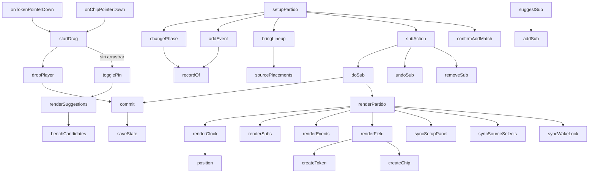

# js/partido.js

La solapa **En vivo** (grupo Partido; su panel es `panel-partido`): el modo en vivo de
un partido. Tiene un reloj (1.er tiempo, entretiempo, 2.º tiempo y final), el marcador,
botones de un toque para anotar jugadas (gol nuestro, gol rival, jugada de gol, jugada
peligrosa; y falta, tiro libre, córner, lateral y penal, que preguntan si fue a favor o en
contra), una **cancha propia del partido** con las jugadoras y el banco, y los
cambios con su estado "por hacer" y "hecho". Lo ya anotado se ve después en la
solapa [Jugados](jugados.md). Formación sigue siendo solo
planificación: acá se elige el mismo partido (rival y fecha) y se **trae la
alineación** de un plan de Formación o de una táctica guardada.

Está dentro de una función que se ejecuta sola (IIFE) y expone
`window.setupPartido`, `window.renderPartido` y `window.removeMatchLog`, que
[js/app.js](app.md) llama con un `typeof` de por medio. Usa de `app.js`:
`state`, `saveState`, `currentMatch`, `makeMatch`, `matchLabel`,
`clampToField`, `moveGhost`, `escapeHtml` y las constantes y funciones de
saneamiento del registro (`MATCH_DURATIONS`, `sanitizeLogItems`...).

## Modelo de datos

Un registro por partido en `state.matchLogs` (no dentro de `state.matches`: al
traer datos de la Sheet, `normalizeRemoteState` reconstruye los partidos y se
llevaría lo que no conoce):

```
state.matchLogs = [
  { id: <id del partido>, name: <rival>, createdAt, updatedAt, deleted, items: [...] }
]
```

Es el mismo formato que Tácticas y Simulaciones, así viaja por la misma hoja
genérica del Apps Script (`PartidosVivo`) y se une con la Sheet por
`updatedAt` (ver [[eliminación blanda (soft delete)]]): un partido anotado en
la cancha, sin señal, no se pierde cuando después se sincroniza. Los `items`:

| type | campos | qué es |
|---|---|---|
| `meta` | `duration, phase, t1Start, t1End, t2Start, t2End, lineup, field` | uno solo: minutos de cada tiempo (15, 20, 25, 30 o 45), la fase (`idle`, `t1`, `ht`, `t2`, `end`), las horas de inicio y fin de cada tiempo en milisegundos, quiénes estaban en la cancha al arrancar (`lineup`) y la **cancha del partido ahora** (`field`: `{ nombre: { x, y } }`) |
| `event` | `id, kind, side, half, sec, player, assist, note` | una jugada: `goal`, `goalRival`, `chance` o `danger` (ya dicen de qué lado son), o `foul`, `freeKick`, `corner`, `throwIn` o `penalty`, que llevan `side` = `for` (a favor) o `against` (en contra); `half` y `sec` = tiempo (1 o 2) y segundos transcurridos **dentro** de ese tiempo |
| `sub` | `id, out, in, status, half, sec` | un cambio: `pending` (por hacer) o `done` (hecho, con el momento en que se hizo) |

`sanitizeLogItems` (en `app.js`) limpia todo lo que llega de afuera: descarta
jugadas o cambios inválidos, pone un tope de cantidad, acota los segundos, deja
la cancha dentro de los límites (`sanitizeLiveField`) y, si la fase pedida no
tiene las marcas de tiempo que necesita, vuelve a la última fase que sí las
tiene. Ver es no crear: el registro de un partido recién se arma cuando se anota
o se mueve algo (`recordOf(true)`). Un registro de la primera versión (sin
`field`) se abre igual: el reloj y las jugadas se conservan y la cancha arranca
vacía.

## La cancha del partido es una copia

`meta.field` **no es** el plan de Formación: es una copia que se hace al tocar
"Traer alineación". Todo lo que pasa durante el partido (arrastrar jugadoras,
mandar a alguien al banco, los cambios "Hecho") modifica solo esa copia, y los
planes A/B/C de Formación quedan como se pensaron. La contrapartida: si se cambia
un plan en Formación después de traerlo, Partido no se entera solo; hay que
volver a traerlo.

## Flujo interno



## El tiempo: `position` / `totalSec` / `minuteNumber` / `minuteLabel`

No hay un contador que va sumando: se guardan las **horas de inicio y fin** de
cada tiempo (`t1Start`, `t1End`, `t2Start`, `t2End`) y el reloj se calcula
restando contra `Date.now()`. Por eso sigue bien aunque se bloquee el celular,
se cambie de solapa o se recargue la página, y no depende de que ningún
`setInterval` siga corriendo (el que hay cada 250 ms solo redibuja el número).

- **`position(meta, now)`**: en qué tiempo y a cuántos segundos de ese tiempo
  está (`{ half, sec }`); en el entretiempo y en el final queda congelado.
- **`totalSec`**: el 2.º tiempo sigue contando desde donde terminó el 1.º: en un
  partido de 25 minutos arranca en 25:00, como el reloj de un partido.
- **`minuteNumber` / `minuteLabel`**: a los 23:10 es el minuto 24 (como se dice
  en el fútbol). Si el 1.er tiempo pasa de su duración se muestra `25+2'`.
- Cada jugada y cada cambio guardan `half` y `sec` (no el minuto ya calculado),
  así cambiar la duración después no los desacomoda.

## Fases: `changePhase` / `nudge` / `setDuration` / `resetLog`

El botón principal avanza la fase: Iniciar 1.er tiempo, Fin del 1.er tiempo,
Iniciar 2.º tiempo, Finalizar partido y, ya terminado, Reabrir partido (sigue
desde donde estaba sin perder lo que ya corrió). **Terminar un tiempo pide un
segundo toque** (`armedPhase`, 3 segundos): un toque de más en la cancha no
debería cortar el reloj. Al arrancar el 1.er tiempo se guarda la alineación
inicial (`lineup`, las jugadoras de `field` en ese momento), que después sirve
para calcular los minutos jugados.

`nudge` suma o resta un minuto al tiempo en juego (por si se olvidó de arrancar
justo cuando salió la pelota; nunca deja el inicio en el futuro; no mueve las
jugadas ya anotadas), `setDuration` elige 15, 20, 25, 30 o 45 minutos **por
tiempo** y `resetLog` borra el registro del partido (con doble toque).

## Jugadas: `addEvent` / `updateEvent` / `removeEvent`

Los cuatro botones de la barra guardan la jugada con el minuto actual **de un
toque**, sin preguntar nada (en la cancha no hay manos para más) y muestran un
aviso breve que flota debajo de la barra. El detalle se completa después en la
lista de "Jugadas del partido": quién metió el gol y quién asistió (`player`,
`assist`), quién tuvo la jugada de gol, una nota, y el minuto, que se puede
corregir a mano (sirve para cargar jugadas mirando la grabación después). Se
guarda al salir del campo (`change`, no `input`), así la lista no se redibuja
mientras se escribe. El marcador sale de contar los `goal` y los `goalRival`.

### Falta, tiro libre, córner, lateral y penal: `askSide` / `chooseSide`

Debajo de los cuatro botones grandes hay una fila chica con cinco más (Falta, Tiro
libre, Córner, Lateral y Penal). Como cada una puede ser **a favor o en contra**, en vez
de duplicar los botones (diez más) se tocan en dos pasos: al tocar uno, esa **misma fila**
se convierte en el selector "A favor / En contra" (`askSide`), y al elegir el lado
(`chooseSide`) se anota la jugada. La fila mide lo mismo antes y después, así la barra no
cambia de alto ni mueve la cancha. Detalles:

- El **minuto es el del primer toque**, no el de cuando se elige el lado (`pendingSide`
  guarda la posición del reloj en ese momento).
- Se cancela con la ✕, al cambiar de partido o **solo a los 8 segundos** (`SIDE_ASK_MS`),
  para que un toque perdido no deje la pregunta abierta en pleno partido.
- Ninguna de estas jugadas toca el marcador.
- El "quién" se completa después, abajo, en la lista: un desplegable cuya leyenda depende
  de la jugada y el lado (`WHO_PROMPTS`: "Quién la recibió…" / "Quién la cometió…", "Quién
  lo ejecutó…", "Quién lo pateó…"). El lado también se puede corregir ahí mismo (`updateEvent`
  con el campo `side`), y la jugada pasa a llamarse "Falta a favor" o "Falta en contra"
  (`eventLabel`) conservando a quién se eligió.
- `sanitizeLogItems` (en `app.js`) le pone `side` a estas jugadas (a favor si falta o viene
  raro) y se lo saca a las que no lo llevan, y descarta un tipo que no conoce.
- Lo que la solapa comparte con [Jugados](jugados.md) (`KIND_LABELS`, `eventLabel`,
  `minuteLabel`...) se expone en `window.PartidoUtil`.

## Traer la alineación: `bringLineup` / `sourcePlacements` / `syncSourceSelects`

El panel de arriba ("Partido y alineación") tiene el selector de partido (el
mismo `state.activeMatch` que usa Formación), "+ Partido" (crea un partido con
`makeMatch`, que también aparece en Formación) y "Traer alineación de":

- **Formación del partido**: un plan (A, B o C) y una forma (2-3-2, 3-2-2, 2-2-3
  o Libre) del partido elegido. Al cambiar de partido se propone su plan y su
  forma activos. Solo se copian jugadoras que todavía existen.
- **Táctica guardada**: las jugadoras de la táctica con su posición (los rivales
  y los nombres que ya no existen se descartan).

Con el partido ya empezado (o con cambios hechos), traer de nuevo pisa lo que se
fue moviendo, así que pide un segundo toque. El panel se abre solo mientras el
partido no empezó y **se pliega cuando arranca** (`syncSetupPanel`), para dejar a
la vista la cancha; su título resume rival y cuántas hay en la cancha, y si se
abre o cierra a mano se respeta.

## Mover jugadoras: `onTokenPointerDown` / `onChipPointerDown` / `dropPlayer`

Mismo gesto que en Formación, pero sobre `#matchField` y `meta.field`: se arrastra
una ficha con un "ghost" que sigue al puntero por toda la pantalla; soltada
adentro de la cancha se ubica, soltada afuera va al banco. Desde el banco
(`#liveAvailable`) se arrastra a la cancha. Si el gesto se cancela
(`pointercancel`) se limpia sin cambiar nada. Cada ficha tiene un círculo
transparente más grande que el visible para que no cueste agarrarla con el dedo.

Un toque o clic **sin arrastrar** (el puntero se mueve menos de `TAP_PX` = 6 píxeles)
no mueve nada: `startDrag` recién crea el "ghost" cuando el puntero se aleja, y si
no lo hizo el gesto es un toque, que fija el panel de la jugadora (ver abajo). Así
tocar una ficha tampoco la corre unos píxeles sin querer.

## Perfil y cambios sugeridos: `renderSuggestions` / `benchCandidates` / `suggestSub`

Al elegir una jugadora de la cancha aparece un panel (`#liveSuggestions`, dentro del
banco) con su **gráfico de perfil** (el radar de atributos, con `buildOrUpdateRadar` de
`app.js`) y los **cambios sugeridos** del banco.

- **Vista previa con el mouse**: pasar el mouse por una ficha muestra el panel
  (`hoverName`) y sacarlo lo oculta, igual que en Formación. Con el dedo no existe el
  "pasar por encima", y en pantallas de hasta 640 px tampoco hay vista previa: ahí el
  panel es una hoja fija abajo que taparía la ficha antes de tocarla.
- **Fijarlo con un toque o clic** (`pinnedName`, `togglePin`): la ficha se marca con un
  borde amarillo (`.selected`) y el panel queda visible hasta tocar la ✕, tocar la
  cancha en un lugar vacío, tocar a otra jugadora o cambiar de partido. Recién fijado
  muestra el botón **Cambio** en cada sugerida.
- **`benchCandidates`**: del banco (las que no están en `meta.field`), primero las que
  juegan el mismo puesto que la elegida (principal o secundario, como las alternativas
  de Formación), ordenadas de mejor a peor promedio. Si nadie del banco juega ese
  puesto, lo dice y muestra todo el banco. Cada una lleva su promedio (el mismo cálculo
  y colores de la solapa Jugadora).
- **`suggestSub`**: tocar "Cambio" deja armado el cambio **por hacer** (sale la
  elegida, entra la sugerida), lo suma a los chips de la barra y cierra el panel; no
  hace el cambio, para eso sigue el "Hecho". Pedir dos veces el mismo cambio avisa y
  no lo duplica.
- En escritorio el panel va dentro de la tarjeta del banco; en celular es una hoja fija
  abajo de la pantalla (con el gráfico más chico), para que no empuje la cancha
  mientras se toca.

## Cambios: `addSub` / `doSub` / `undoSub` / `removeSub`

Un cambio se arma con anticipación ("+ Cambio": sale una de las que están en la
cancha del partido, entra una del banco) y queda **por hacer**: aparece en la
lista y como un chip en la barra fija, con el botón "Hecho" a mano. **Hecho**
(`doSub`) hace tres cosas a la vez: anota en qué momento del partido se hizo,
pasa la entrada al lugar exacto de la salida en `meta.field` y deja a la que
salió en el banco. Antes de hacerlo vuelve a comprobar que la que sale siga en
la cancha y la que entra no, y si no avisa en vez de tocar nada. **Deshacer**
revierte la cancha y devuelve el cambio a "por hacer". Mandar a alguien al banco
arrastrándola no cuenta como cambio.

## Pantalla encendida: `syncWakeLock`

Mientras el reloj corre pide al navegador que no apague la pantalla
(`navigator.wakeLock`), y la suelta al entretiempo y al final. Si el navegador
no lo soporta o lo rechaza, no pasa nada: el reloj sigue bien igual, solo que
puede apagarse la pantalla.

## Dibujo: `renderPartido`

Se llama desde `showTab` al abrir la solapa, desde `renderAll` (por ejemplo al
llegar los datos de la Sheet) y después de cada acción. Redibuja el selector de
partido, el reloj, el marcador, el botón principal, los chips de la barra, la
lista de cambios, la de jugadas, la cancha con su banco y, si está abierto, el
formulario de cambio. El HTML está en [index.html](../index.md): la barra
`#liveBar` (fija arriba con `position: sticky`, para verla mientras se mira la
cancha), el panel `#liveSetup`, la cancha `#matchField` con su banco y el detalle
`#liveDetails`, debajo.

## Dependencias

| Dependencia | Para qué |
|---|---|
| [js/app.js](app.md) | estado, `saveState`, partidos, tácticas guardadas, saneamiento del registro y del arrastre |
| `navigator.wakeLock` | mantener la pantalla encendida (opcional) |
| `Date.now` | el reloj se calcula contra la hora actual |

Ver también el [Glosario](../GLOSSARY.md).
