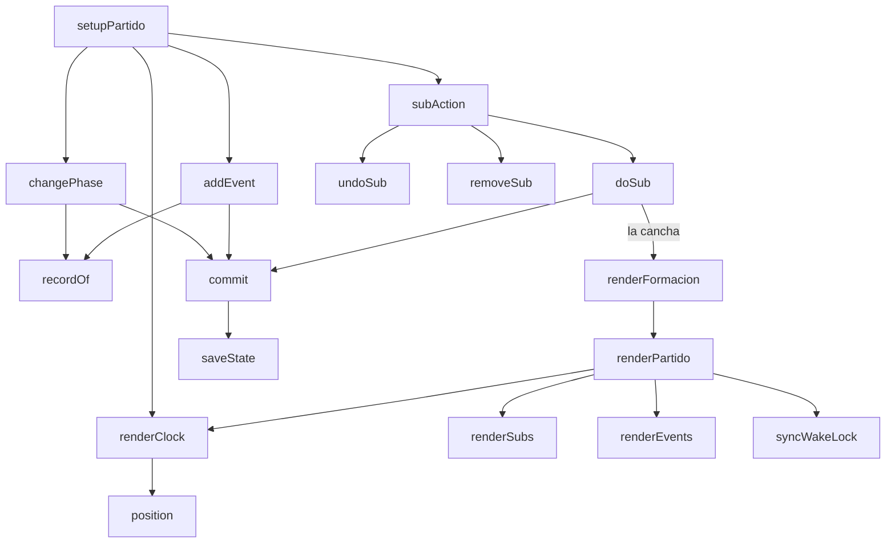

# js/partido.js

La barra **En vivo** de la solapa Formación: un reloj del partido (1.er
tiempo, entretiempo, 2.º tiempo y final), el marcador, botones de un toque para
anotar jugadas (gol nuestro, gol rival, jugada de gol, jugada peligrosa) y los
cambios de jugadoras con su estado "por hacer" y "hecho". Existe porque el DT
usa Formación mientras se juega: no es una solapa aparte, sino el modo en vivo
del mismo partido que ya se elige arriba en Formación.

Está dentro de una función que se ejecuta sola (IIFE) y expone
`window.setupPartido`, `window.renderPartido` y `window.removeMatchLog`, que
[js/app.js](app.md) llama con un `typeof` de por medio. Usa de `app.js`:
`state`, `saveState`, `currentPlan`, `renderFormacion`, `escapeHtml` y las
constantes y funciones de saneamiento del registro (`MATCH_DURATIONS`,
`sanitizeLogItems`...).

## Modelo de datos

Un registro por partido en `state.matchLogs` (no dentro de `state.matches`: al
traer datos de la Sheet, `normalizeRemoteState` reconstruye los partidos y se
llevaría lo que no conoce):

```
state.matchLogs = [
  { id: <id del partido>, name: <rival>, createdAt, updatedAt, deleted, items: [...] }
]
```

Es el mismo formato que Tácticas y Simulaciones, así viaja por la misma hoja
genérica del Apps Script (`PartidosVivo`) y se une con la Sheet por
`updatedAt` (ver [[eliminación blanda (soft delete)]]): un partido anotado en
la cancha, sin señal, no se pierde cuando después se sincroniza. Los `items`:

| type | campos | qué es |
|---|---|---|
| `meta` | `duration, phase, t1Start, t1End, t2Start, t2End, lineup` | uno solo: minutos de cada tiempo (15, 20, 25, 30 o 45), la fase (`idle`, `t1`, `ht`, `t2`, `end`), las horas de inicio y fin de cada tiempo en milisegundos y quiénes estaban en la cancha al arrancar |
| `event` | `id, kind, half, sec, player, assist, note` | una jugada: `goal`, `goalRival`, `chance` o `danger`; `half` y `sec` = tiempo (1 o 2) y segundos transcurridos **dentro** de ese tiempo |
| `sub` | `id, out, in, status, half, sec` | un cambio: `pending` (por hacer) o `done` (hecho, con el momento en que se hizo) |

`sanitizeLogItems` (en `app.js`) limpia todo lo que llega de afuera: descarta
jugadas o cambios inválidos, pone un tope de cantidad, acota los segundos y, si
la fase pedida no tiene las marcas de tiempo que necesita, vuelve a la última
fase que sí las tiene. Ver es no crear: el registro de un partido recién se
arma cuando se anota algo (`recordOf(true)`).

## Flujo interno



## El tiempo: `position` / `totalSec` / `minuteNumber` / `minuteLabel`

No hay un contador que va sumando: se guardan las **horas de inicio y fin** de
cada tiempo (`t1Start`, `t1End`, `t2Start`, `t2End`) y el reloj se calcula
restando contra `Date.now()`. Por eso sigue bien aunque se bloquee el celular,
se cambie de solapa o se recargue la página, y no depende de que ningún
`setInterval` siga corriendo (el que hay cada 250 ms solo redibuja el número).

- **`position(meta, now)`**: en qué tiempo y a cuántos segundos de ese tiempo
  está (`{ half, sec }`); en el entretiempo y en el final queda congelado.
- **`totalSec`**: el 2.º tiempo sigue contando desde donde terminó el 1.º: en un
  partido de 25 minutos arranca en 25:00, como el reloj de un partido.
- **`minuteNumber` / `minuteLabel`**: a los 23:10 es el minuto 24 (como se dice
  en el fútbol). Si el 1.er tiempo pasa de su duración se muestra `25+2'`.
- Cada jugada y cada cambio guardan `half` y `sec` (no el minuto ya calculado),
  así cambiar la duración después no los desacomoda.

## Fases: `changePhase` / `nudge` / `setDuration` / `resetLog`

El botón principal avanza la fase: Iniciar 1.er tiempo, Fin del 1.er tiempo,
Iniciar 2.º tiempo, Finalizar partido y, ya terminado, Reabrir partido (sigue
desde donde estaba sin perder lo que ya corrió). **Terminar un tiempo pide un
segundo toque** (`armedPhase`, 3 segundos): un toque de más en la cancha no
debería cortar el reloj. Al arrancar el 1.er tiempo se guarda la alineación
inicial (`lineup`), que después sirve para calcular los minutos jugados.

`nudge` suma o resta un minuto al tiempo en juego (por si se olvidó de arrancar
justo cuando salió la pelota; nunca deja el inicio en el futuro), `setDuration`
elige 15, 20, 25, 30 o 45 minutos **por tiempo** y `resetLog` borra el registro
del partido (con doble toque).

## Jugadas: `addEvent` / `updateEvent` / `removeEvent`

Los cuatro botones de la barra guardan la jugada con el minuto actual **de un
toque**, sin preguntar nada (en la cancha no hay manos para más) y muestran un
aviso breve. El detalle se completa después en la lista de "Jugadas del
partido": quién metió el gol y quién asistió (`player`, `assist`), quién tuvo la
jugada de gol, una nota, y el minuto, que se puede corregir a mano (sirve para
cargar jugadas mirando la grabación después). Se guarda al salir del campo
(`change`, no `input`), así la lista no se redibuja mientras se escribe. El
marcador sale de contar los `goal` y los `goalRival`.

## Cambios: `addSub` / `doSub` / `undoSub` / `removeSub`

Un cambio se arma con anticipación ("+ Cambio": sale una de las que están en la
cancha, entra una de las disponibles) y queda **por hacer**: aparece en la
lista y como un chip en la barra fija, con el botón "Hecho" a mano. **Hecho**
(`doSub`) hace tres cosas a la vez: anota en qué momento del partido se hizo,
pasa la entrada al lugar exacto de la salida en la cancha que se está viendo
(`currentPlacements`: la del plan y la forma activos) y deja a la que salió en
"Disponibles". Antes de hacerlo vuelve a comprobar que la que sale siga en la
cancha y la que entra no, y si no avisa en vez de tocar nada. **Deshacer** revierte
la cancha y devuelve el cambio a "por hacer".

## Pantalla encendida: `syncWakeLock`

Mientras el reloj corre pide al navegador que no apague la pantalla
(`navigator.wakeLock`), y la suelta al entretiempo y al final. Si el navegador
no lo soporta o lo rechaza, no pasa nada: el reloj sigue bien igual, solo que
puede apagarse la pantalla.

## Dibujo: `renderPartido`

Se llama al final de `renderFormacion` (así se actualiza al cambiar de partido,
de plan o al mover una jugadora) y después de cada acción. Redibuja el reloj, el
marcador, el botón principal, los chips de la barra, la lista de cambios, la de
jugadas y, si está abierto, el formulario de cambio. El HTML está en
[index.html](../index.html): la barra `#liveBar` (fija arriba con
`position: sticky`, para verla mientras se mira la cancha) y el detalle
`#liveDetails`, debajo de la cancha.

## Dependencias

| Dependencia | Para qué |
|---|---|
| [js/app.js](app.md) | estado, `saveState`, formación activa, saneamiento del registro |
| `navigator.wakeLock` | mantener la pantalla encendida (opcional) |
| `Date.now` | el reloj se calcula contra la hora actual |

Ver también el [Glosario](../GLOSSARY.md).
