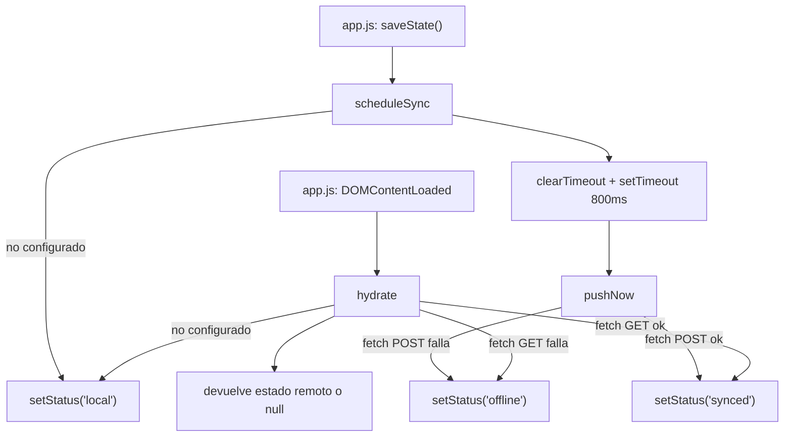

# js/sheets-integration.js

Capa de sincronización automática con Google Sheets: no expone ninguna UI
propia (no hay pestaña "Sincronizar"), solo dos funciones que
[js/app.js](app.md) llama en los momentos justos, más un indicador visual
de estado en el header.

## Flujo interno

## `SHEET_API_URL`

Constante de configuración: la URL del "Web App" que resulta de desplegar
[data/google-apps-script.js](../data/google-apps-script.md) (ver
[SETUP.md](../../SETUP.md)). Mientras tenga el valor placeholder
`'PASTE_YOUR_WEB_APP_URL_HERE'`, `isConfigured()` devuelve `false` y toda
la sincronización queda deshabilitada (la app sigue funcionando solo con
`localStorage`).

## `isConfigured()`

Chequea que `SHEET_API_URL` sea una URL real de Apps Script (empieza con
`https://script.google.com/`).

## `setStatus(kind, title)`

Actualiza la clase y el `title` (tooltip) del elemento `#syncStatus` en
el header de [index.html](../index.md), con cuatro estados posibles:
`local` (gris, sin configurar), `syncing` (amarillo), `synced` (verde) y
`offline` (rojo, falló la conexión).

## `hydrate()`

Se llama una sola vez al arrancar la app. Si Sheets está configurado,
hace un `fetch` `GET` a `SHEET_API_URL` (que dispara `doGet` en el Apps
Script) y devuelve el JSON con jugadoras y formaciones. Si falla o no
está configurado, devuelve `null` y `app.js` sigue usando lo que haya en
`localStorage`.

## `scheduleSync(state)`

Se llama en cada `saveState()` de `app.js` (es decir, en cada cambio: un
slider, un drag, una jugadora agregada). Usa un `debounce` de 800ms
(ver [[debounce]] en el [Glosario](../GLOSSARY.md)) para no mandar un
`POST` por cada evento intermedio — solo cuando el usuario deja de tocar
algo por ese lapso.

## `pushNow(state)`

Manda el `POST` real a `SHEET_API_URL` con todo el estado como JSON en el
body, usando `Content-Type: text/plain` a propósito para evitar el
preflight de CORS que Apps Script no maneja (ver [[CORS / preflight]] en
el Glosario). El Apps Script (`doPost`) sobrescribe por completo las
hojas `Jugadoras`, `Formacion` y `Meta` con este payload.

## Dependencias externas

| Dependencia | Uso |
|---|---|
| `fetch` (API del navegador) | Pedidos GET/POST al Web App de Apps Script |
| [data/google-apps-script.js](../data/google-apps-script.md) | Backend real, desplegado por el usuario sobre su propia Sheet |
| `#syncStatus` (elemento en [index.html](../index.md)) | Feedback visual del estado de sync |

Ver también [GLOSSARY.md](../GLOSSARY.md).
