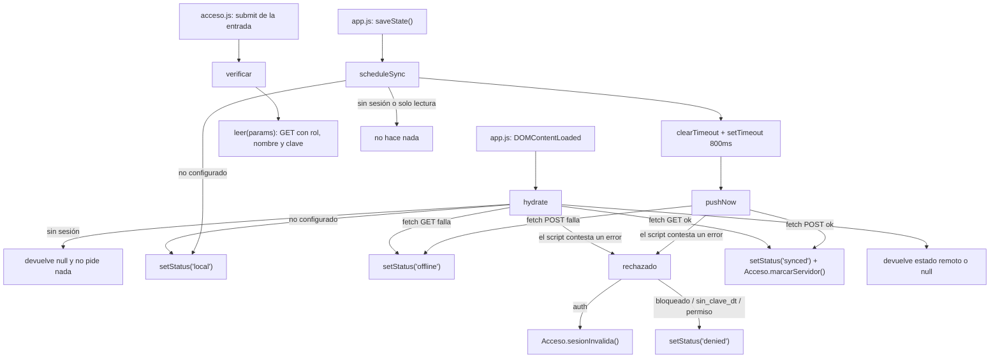

# js/sheets-integration.js

Capa de sincronización automática con Google Sheets: no expone ninguna UI
propia (no hay pestaña "Sincronizar"), solo tres funciones que
[js/app.js](app.md) y [js/acceso.js](acceso.md) llaman en los momentos
justos, más un indicador visual de estado en el header.

Cada pedido lleva las credenciales de quien entró (`Acceso.credenciales()`).
El Apps Script decide qué devuelve y quién puede escribir; acá solo se lee su
respuesta para mostrarla en el indicador y para cerrar la sesión si la clave
ya no vale.

## Flujo interno

```mermaid
flowchart TD
    Load["app.js: DOMContentLoaded"] --> hydrate
    hydrate -->|"sin sesión"| SinPedido["devuelve null y no pide nada"]
    hydrate -->|"no configurado"| setStatusLocal["setStatus('local')"]
    hydrate -->|"fetch GET falla"| setStatusOffline["setStatus('offline')"]
    hydrate -->|"el script contesta un error"| rechazado
    hydrate -->|"fetch GET ok"| setStatusSynced["setStatus('synced') + Acceso.marcarServidor()"]
    hydrate --> ReturnRemote["devuelve estado remoto o null"]

    Entrada["acceso.js: submit de la entrada"] --> verificar
    verificar --> leer["leer(params): GET con rol, nombre y clave"]

    SaveState["app.js: saveState()"] --> scheduleSync
    scheduleSync -->|"sin sesión o solo lectura"| NoEscribe["no hace nada"]
    scheduleSync -->|"no configurado"| setStatusLocal
    scheduleSync --> ClearTimer["clearTimeout + setTimeout 800ms"]
    ClearTimer --> pushNow
    pushNow -->|"fetch POST ok"| setStatusSynced
    pushNow -->|"el script contesta un error"| rechazado
    pushNow -->|"fetch POST falla"| setStatusOffline
    rechazado -->|"auth"| sesionInvalida["Acceso.sesionInvalida()"]
    rechazado -->|"bloqueado / sin_clave_dt / permiso"| setStatusDenied["setStatus('denied')"]
```

## `SHEET_API_URL` / `isConfigured()`

La URL del "Web App" que resulta de desplegar
[data/google-apps-script.js](../data/google-apps-script.md) (ver
[SETUP.md](../../SETUP.md)). `isConfigured()` chequea que sea una URL real de
Apps Script (empieza con `https://script.google.com/`); si no, toda la
sincronización queda deshabilitada y la app trabaja solo con `localStorage`.

## `setStatus(kind, title)`

Actualiza la clase y el `title` (tooltip) del elemento `#syncStatus` en el
header de [index.html](../index.md), con cinco estados: `local` (gris, sin
configurar), `syncing` (amarillo), `synced` (verde), `offline` (rojo claro,
falló la conexión) y `denied` (rojo fuerte: el script rechazó el pedido, por
ejemplo por falta de permiso o por demasiados intentos).

## `leer(params)` / `verificar(creds)`

`leer` hace un `GET` a `SHEET_API_URL` con `rol`, `nombre` y `clave` en la URL
(un `fetch` no queda en el historial del navegador) y una marca de tiempo para
que nada quede en caché. **Se usa GET y no POST a propósito**: un `POST` de la
app nueva contra un script viejo sería leído por el `doPost` viejo como un
estado vacío y borraría la Sheet. `verificar` la usa desde la pantalla de
entrada y devuelve `{ estado, protegido, minutos }`, con estado `ok`, `auth`,
`bloqueado`, `ocupado`, `sin_clave_dt`, `red` o `sin_configurar`.

## `hydrate()`

Se llama una sola vez al arrancar la app. Sin sesión no pide nada. Con sesión,
pide el estado al script (que dispara `doGet`) y devuelve el JSON que ese rol
puede ver; si el script contesta con un error, lo pasa a `rechazado`. Si falla
la conexión o no está configurado, devuelve `null` y `app.js` sigue usando lo
que haya en `localStorage`.

## `scheduleSync(state)` / `pushNow(state)`

`scheduleSync` se llama en cada `saveState()` de `app.js`. **Si no hay sesión o
el rol no edita (jugadora), no hace nada: nunca se manda una escritura.** Usa un
`debounce` de 800ms (ver [[debounce]] en el [Glosario](../GLOSSARY.md)).
`pushNow` manda el `POST` con `{ auth, ...estado }` como JSON, con
`Content-Type: text/plain` para evitar el preflight de CORS que Apps Script no
maneja (ver [[CORS / preflight]] en el Glosario). **Ahora lee la respuesta**
(antes la ignoraba y siempre decía "Sincronizado"): si el script rechazó el
guardado, el indicador lo dice. Si la respuesta no se puede leer, muestra
"Enviado (sin confirmación)".

## `rechazado(resp)`

Traduce un error del script al indicador: `auth` cierra la sesión (la clave ya
no vale); `bloqueado` avisa cuántos minutos esperar; `sin_clave_dt` avisa que
al script le falta `DT_KEY`; `ocupado` se trata como falta de conexión; el
resto (`permiso`, `formato`...) queda como "Sin permiso para guardar".

## Dependencias externas

| Dependencia | Uso |
|---|---|
| `fetch` (API del navegador) | Pedidos GET/POST al Web App de Apps Script |
| [data/google-apps-script.js](../data/google-apps-script.md) | Backend real, desplegado por el usuario sobre su propia Sheet |
| [js/acceso.js](acceso.md) | Credenciales y rol de quien entró (`window.Acceso`) |
| `#syncStatus` (elemento en [index.html](../index.md)) | Feedback visual del estado de sync |

Ver también [GLOSSARY.md](../GLOSSARY.md).
