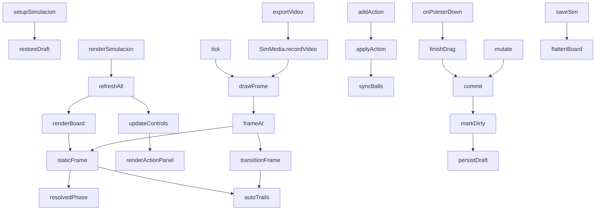

# js/simulacion.js

La pestaña **Simulación**: una jugada animada en fases. Es distinta de
[Táctica](tactica.md) (una jugada dibujada, una sola foto): acá la jugada
tiene varias **fases**, cada una con nombre, nota y tiempo, y al reproducirla
las jugadoras, los rivales y la pelota se deslizan de una fase a la
siguiente. Las transiciones se arman con **acciones** (avanzar dos
casilleros, pase a Agos, centro, tiro al arco, gol...) sobre una grilla de
casilleros, con cuadros de texto y zonas sombreadas por fase. Se guarda con
nombre, forma un historial y se descarga como video MP4.

Está dentro de una función que se ejecuta sola (IIFE) y solo expone
`window.setupSimulacion` y `window.renderSimulacion`, que
[js/app.js](app.md) llama con un `typeof` de por medio. Depende de
[js/simulacion-media.js](simulacion-media.md) (el dibujo y la grabación) y
de `app.js` (`state`, `saveState`, `sanitizeSimItems`, `MAX_SIM_PHASES`...).

## Modelo de datos

```
state.simulations = [
  { id, name, createdAt, updatedAt, deleted, items: [...] }
]
```

Los `items` son una lista plana (así entra sin cambios en la hoja
`Simulaciones`, que tiene el mismo formato que `Tacticas`; por eso sumar
tipos nuevos no exige volver a pegar el Apps Script):

| type | campos | qué es |
|---|---|---|
| `phase` | `ph, name, note, dur, seq` | una por fase: nombre, nota, segundos de la transición **hacia** esa fase, y si sus acciones van una tras otra |
| `player` | `ph, x, y, name` | una jugadora en esa fase |
| `rival` | `ph, x, y, label` | un rival (1 a 11) |
| `ball` | `ph, x, y, carrier` | la pelota; `carrier` es la clave de quien la lleva (`p:Ine`, `r:3`) o `''` si está suelta |
| `text` | `ph, x, y, text, color` | un cuadro de texto que aparece solo en esa fase |
| `zone` | `ph, zc, zr, color` | un casillero sombreado en esa fase (columna 0-2, fila 1-4) |
| `action` | `ph, who, act, dir, n, zone, target, side` | una acción de la transición **hacia** la fase `ph` (ver abajo) |

`ph` es el número de fase (0 a 11). En memoria (`board`) las fases están
aparte (`board.phases = [{ name, note, dur, seq }]`) y solo al guardar
(`flattenBoard`) se vuelven a mezclar con los items; `splitFlat` hace lo
inverso al abrir.

**Identidad entre fases.** Para animar hay que saber qué pieza de una fase es
la misma de la siguiente: una jugadora se identifica por su nombre, un rival
por su número (`keyOf`) y la pelota es siempre una sola (`b:ball`). Por eso
"+ Fase" copia las piezas tal cual (solo las piezas: no los textos, los
casilleros ni las acciones): cada fase parte de la anterior y solo se mueve
lo que cambia.

## Flujo interno



## Grilla de casilleros

La cancha se divide en **3 columnas por 4 filas**: columnas A, B y C de
izquierda a derecha; filas 1 a 4 contadas desde el arco propio (1 defensa
baja, 2 defensa alta, 3 ataque bajo, 4 ataque alto). Los casilleros se
alinean con las líneas de la cancha (10-290 x 10-390), así que miden
280/3 x 95. `cellCenter(c, r)` da su centro, `cellAt(x, y)` dice en cuál
casillero cae un punto y `M.cellRect(c, r)` es su rectángulo (en
[simulacion-media.js](simulacion-media.md)). "Ver grilla" la dibuja con los
nombres (A1 a C4); con la herramienta Zona se muestra sola.

## Acciones de una transición: `applyAction` / `addAction` / `removeAction`

Una acción mueve **una pieza** de la fase anterior a la actual. La app
calcula el destino y lo **escribe en la fase actual** (después se puede
ajustar arrastrando). Cada acción se calcula siempre desde la posición de la
pieza en la fase anterior, por eso agregar otra acción a la misma pieza
simplemente reemplaza la anterior (una acción por pieza y transición).

Acciones de jugadoras y rivales:

- **Mover** (`move`): avanzar (atacar), retroceder (defender), ir a la
  izquierda o a la derecha, y las cuatro diagonales, de 1 a 3 casilleros.
  Es **relativo**: sube o baja una altura de casillero y mantiene su lugar
  dentro del casillero (hay 16 fichas y solo 12 casilleros), y se frena en
  las líneas de la cancha.
- **Ir a la zona** (`goto`): al centro de un casillero, corrido lo mínimo
  para no encimarse con otra ficha (`nudgeFree`).
- **Presionar a** (`press`): se acerca a otra pieza hasta unos 32 de
  distancia, viniendo desde donde estaba. **Marcar a** (`mark`): se pone del
  lado de su propio arco de la pieza marcada (las nuestras abajo del rival,
  los rivales arriba). Las dos usan la posición **de llegada** de la pieza
  objetivo en la fase actual, así que conviene que el objetivo ya esté en su
  lugar; el orden de la lista es el orden en que se calculan.

Acciones de la pelota (independientes de la jugadora):

- **Pase a** (`pass`), **Centro a** (`cross`) y **Pase por arriba a** (`lob`):
  a una jugadora (la pelota queda pegada a ella) o, en centro y pase por
  arriba, a una zona (queda suelta en el centro del casillero).
- **Al espacio** (`space`): a una zona, por el piso.
- **Tiro al arco** (`shot`) y **Gol** (`goal`): al palo izquierdo, al medio o
  al derecho (`GOAL_X` / `GOAL_Y` en `simulacion-media.js`); en gol la
  pelota entra más adentro del arco.

Lo que las mantiene coherentes:

- **Una acción vale mientras la pieza esté donde ella la dejó.** Si después
  se arrastra la pieza a mano (o se la saca de la fase), la acción se quita
  sola (`finishDrag`, `removeFromPhase`).
- **`removeAction`** devuelve la pieza a donde estaba en la fase anterior
  (`restoreFromSource`).
- **"Recalcular"** (`recomputeActions`) vuelve a aplicar todas las acciones
  de la transición en orden; sirve si se cambió algo en la fase anterior. Las
  que ya no se pueden aplicar (falta una pieza) se descartan. Las fases
  siguientes **no** se recalculan solas: cada fase es una foto.
- Cambiar el nombre de una jugadora (`renameEverywhere`) actualiza también
  las acciones que la nombran.

## Cómo se anima

`transitionFrame(ph, p)` interpola cada pieza entre las dos fases con una
curva suave (`ease`). Cada acción de la pelota le da su estilo (`ballStyleOf`):

- **Por el piso** (pase, al espacio): recto, flecha punteada amarilla.
- **Por el aire** (centro, pase por arriba): la pelota **sube y baja**
  (`_h`, 0 a 1 en forma de arco), se dibuja más grande y levantada y deja su
  sombra en el piso; flecha celeste.
- **Tiro** (tiro al arco, gol): sale rápido y frena (`easeShot`); flecha
  naranja. Si es gol, un **"¡GOL!"** grande aparece al final y queda durante
  la fase: `roomiestPoint` lo pone en el lugar más despejado cerca del área
  rival, para que no tape a nadie.

**Una acción tras otra**: con `seq` activo en la fase, cada acción se lleva
su turno de la transición (el primero de la lista arranca primero) en vez de
moverse todas a la vez. El orden se cambia con los botones ▲ ▼. Las piezas
sin acción (movidas a mano) se mueven durante toda la transición.

Los textos y casilleros sombreados no se interpolan: los de la fase que
termina se apagan al empezar la transición y los de la que llega aparecen
al final.

## Lo que se ve: `resolvedPhase` / `autoTrails` / `staticFrame`

- **`resolvedPhase(ph)`**: las piezas de una fase con la pelota ya
  colocada. La pelota "pegada" a una jugadora no guarda su posición como
  verdad: se calcula a partir de quien la lleva (`carrier`) más un desvío
  fijo (`BALL_DX`, `BALL_DY`), así siempre la acompaña. Un pase es,
  simplemente, que el `carrier` cambie de una fase a la siguiente.
- **`autoTrails(from, to, progressOf, alpha)`**: las flechas de recorrido
  (de dónde vino cada pieza que se movió). Se calculan, no se guardan. La
  punta queda unos píxeles antes de la ficha, así que un movimiento muy
  corto (menos de unas 23 unidades) no dibuja nada. La pelota que va con la
  misma jugadora en las dos fases no suma flecha propia.
- **`staticFrame(ph)`**: una fase quieta, más las flechas de la transición
  que llegó hasta ella, el cartel de gol y la grilla si está activa.

## Línea de tiempo: `holdMs` / `moveMs` / `totalMs` / `frameAt`

Cada fase se "sostiene" un rato (0,9 s, o 2,2 s si tiene nota, para dar
tiempo a leerla) y entre fases hay una transición de `dur` segundos
(elegible por fase, de 0,5 a 6). `totalMs()` los suma y `frameAt(t)` devuelve
el estado visual a los `t` ms (a velocidad 1x). Durante una transición el
texto que se muestra es el de la fase **de llegada**.

## Editar: punteros, herramientas y piezas

Un único juego de eventos sobre el `<svg>` (con *pointer capture*, ver
[[Pointer Events / pointer capture]]). Herramientas (`simTool`):

- **Mover**: arrastrar fichas, la pelota y los textos. Una ficha arrastrada
  **afuera de la cancha** se saca de esa fase. Al soltar la pelota a menos
  de 20 de una ficha se pega a ella; mover a quien la lleva la arrastra.
- **Texto**: escribir en la barra y tocar la cancha. Vuelve a Mover con el
  texto seleccionado (se edita en la misma barra, se arrastra y cambia de
  color con la paleta).
- **Zona**: tocar un casillero para sombrearlo (`toggleZone`); tocarlo con
  el mismo color lo saca y con otro lo recolorea.

`#simSelBar` (la barra de la ficha elegida: cambiar por otra jugadora, dar o
soltar la pelota, quitar de la fase) **ocupa siempre el mismo alto**: sin
nada elegido muestra una ayuda. Si apareciera y desapareciera, el alto de la
página cambiaría al tocar una ficha y, con la página desplazada hasta el
fondo, el navegador corría el scroll y la cancha se movía en pleno arrastre
(bug real que hubo). Por el mismo motivo `#panel-simulacion` tiene
`overflow-anchor: none`.

Otras acciones sobre las piezas: `renamePlayer` (en todas las fases),
`assignRoster` (reemplaza los puestos de una jugada de ejemplo por
jugadoras del plantel según su posición), `importFromFormation` y las fichas
de la lista.

## Fases: `addPhase` / `removePhase` / `goPhase`

`addPhase` inserta una fase **después de la actual** con las mismas piezas en
el mismo lugar (corre los números de las siguientes); `removePhase` la quita
y reordena. Nombre, nota y tiempo se editan en campos que arman un solo punto
de "deshacer" por edición (`bindPhaseField`). Deshacer y Rehacer guardan una
foto de `{ items, phases }`, así que también deshacen agregar o quitar fases y
acciones.

## Reproducir: `play` / `pause` / `tick` / `drawFrame` / `scrubTo`

`tick` corre con `requestAnimationFrame`, suma el tiempo real multiplicado
por la velocidad (0,5x, 1x, 2x) y dibuja con `drawFrame`, que pinta el SVG,
actualiza el texto de la fase (`#simCaption`) y el avance. Se pausa solo si
se cambia de pestaña. "Repetir" vuelve a empezar; el deslizador mueve el
punto de reproducción. Al reproducir la página entra en modo `sim-playing`
(herramientas, acciones y lista de jugadoras quedan deshabilitadas) hasta
apretar "Volver a editar" o una pestaña de fase.

## Guardar y abrir

Igual que en Táctica: `saveSim` (con `asCopy`), `openSim`, `newSim`,
`guard` (barra "cambios sin guardar"), eliminar en dos toques con borrado
"blando" (ver [[eliminación blanda (soft delete)]]) y un borrador en
`localStorage` (`dtcomander_sim_draft`) mientras hay cambios sin guardar.

La lista `state.simulations` también guarda las secuencias de la pestaña
[Secuencia](secuencia.md) (otro modelo de la misma hoja): `visibleSims()` las
oculta porque tienen un item `seq`. Y `window.SimTemplates` expone
`TEMPLATES`, `OUR_BASE` y `RIV_BASE` para que Secuencia arme sus jugadas de
ejemplo a partir de las mismas.

## Punto de partida: `boardFromTemplate` / `boardFromTactic`

- **Jugadas de ejemplo** (`TEMPLATES`): salir jugando de abajo, ataque desde
  medio campo, saque de arco, pase de delantera y jugada de pared. Parten de
  una formación 2-3-2 propia (abajo, atacando hacia arriba) y una rival; cada
  paso solo dice lo que cambia respecto del anterior y, cuando corresponde,
  su acción de pelota (`ballAct`: pase, centro, pase por arriba, tiro, gol),
  casilleros sombreados y textos.
- **Desde una táctica** (`boardFromTactic`): toma las jugadoras, rivales y la
  primera pelota de una táctica guardada como fase 1 (descarta flechas,
  trazos y textos). Es una copia: la táctica original no cambia.

## Descargar video: `exportVideo`

Pasa a modo reproducción, bloquea los controles y llama a
`SimMedia.recordVideo`, que le pide cada cuadro con `getFrame(ms)`: ahí se
calcula el estado a ese momento (a la velocidad elegida), se pinta también
en pantalla y se devuelve para pintar en el video. El video lleva todo lo
que se ve (casilleros, textos, pelota por arriba, cartel de gol) y, si "Ver
grilla" está activa, la grilla. Al terminar entrega el archivo con
`deliverFile`: en celulares abre el menú de compartir (WhatsApp) y en compu
lo descarga (`.mp4`, o `.webm` si el navegador no graba MP4).

## Dependencias

| Dependencia | Para qué |
|---|---|
| [js/simulacion-media.js](simulacion-media.md) | dibujo (SVG y canvas), grilla y grabación de video |
| [js/app.js](app.md) | estado, `saveState`, `sanitizeSimItems`, fechas, colores, `FIELD_BOUNDS` |
| `localStorage` | borrador (`dtcomander_sim_draft`) |
| `navigator.share` | compartir el video desde el celular |

Ver también el [Glosario](../GLOSSARY.md).
