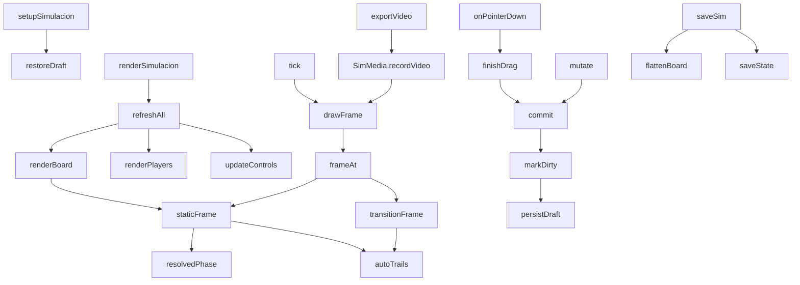

# js/simulacion.js

La pestaña **Simulación**: una jugada animada en fases. Es distinta de
[Táctica](tactica.md) (una jugada dibujada, una sola foto): acá la jugada
tiene varias **fases**, cada una con nombre, nota y tiempo, y al reproducirla
las jugadoras, los rivales y la pelota se deslizan de una fase a la
siguiente, con las flechas de recorrido dibujadas solas. Se guarda con
nombre, forma un historial y se descarga como video MP4.

Está dentro de una función que se ejecuta sola (IIFE) y solo expone
`window.setupSimulacion` y `window.renderSimulacion`, que
[js/app.js](app.md) llama con un `typeof` de por medio. Depende de
[js/simulacion-media.js](simulacion-media.md) (el dibujo y la grabación) y
de `app.js` (`state`, `saveState`, `sanitizeSimItems`, `MAX_SIM_PHASES`...).

## Modelo de datos

```
state.simulations = [
  { id, name, createdAt, updatedAt, deleted, items: [...] }
]
```

Los `items` son una lista plana (así entra sin cambios en la hoja
`Simulaciones`, que tiene el mismo formato que `Tacticas`):

| type | campos | qué es |
|---|---|---|
| `phase` | `ph, name, note, dur` | una por fase: nombre, nota y segundos de la transición **hacia** esa fase |
| `player` | `ph, x, y, name` | una jugadora en esa fase |
| `rival` | `ph, x, y, label` | un rival (1 a 11) |
| `ball` | `ph, x, y, carrier` | la pelota; `carrier` es la clave de quien la lleva (`p:Ine`, `r:3`) o `''` si está suelta |

`ph` es el número de fase (0 a 11). En memoria (`board`) las fases están
aparte (`board.phases = [{ name, note, dur }]`) y solo al guardar
(`flattenBoard`) se vuelven a mezclar con los items; `splitFlat` hace lo
inverso al abrir.

**Identidad entre fases.** Para animar hay que saber qué pieza de una fase es
la misma de la siguiente: una jugadora se identifica por su nombre, un rival
por su número (`keyOf`) y la pelota es siempre una sola (`b:ball`). Por eso
"+ Fase" copia las piezas tal cual: cada fase parte de la anterior y solo se
mueve lo que cambia.

## Flujo interno



## Lo que se ve: `resolvedPhase` / `autoTrails` / `staticFrame` / `transitionFrame`

- **`resolvedPhase(ph)`**: las piezas de una fase con la pelota ya
  colocada. La pelota "pegada" a una jugadora no guarda su posición como
  verdad: se calcula a partir de quien la lleva (`carrier`) más un desvío
  fijo (`BALL_DX`, `BALL_DY`), así siempre la acompaña. Un pase es,
  simplemente, que el `carrier` cambie de una fase a la siguiente: la
  pelota "vuela" de una jugadora a otra por la interpolación.
- **`autoTrails(from, to, progress, alpha)`**: las flechas de recorrido.
  Compara cada pieza entre dos fases y, si se movió, arma una flecha desde
  donde estaba hasta donde está (la pelota, punteada; las jugadoras,
  continuas; los rivales, en rojo claro). Se calculan, no se guardan. La
  punta queda unos píxeles antes de la ficha, así que un movimiento muy
  corto (menos de unas 23 unidades) no dibuja nada: la flecha quedaría
  tapada. La pelota que va con la misma jugadora en las dos fases no suma
  flecha propia (ya se ve el recorrido de ella).
- **`staticFrame(ph)`**: una fase quieta, más las flechas de la transición
  que llegó hasta ella. Es lo que se ve al editar.
- **`transitionFrame(ph, p)`**: la transición de `ph` a `ph + 1` con
  progreso `p` (0 a 1). Las piezas presentes en las dos se interpolan con
  una curva suave (`ease`, lenta al empezar y al terminar); las que solo
  están en una entran o salen con opacidad (`_o`); las flechas de la
  transición crecen mientras las fichas avanzan.

## Línea de tiempo: `holdMs` / `moveMs` / `totalMs` / `frameAt`

Cada fase se "sostiene" un rato (`HOLD_MS` = 0,9 s, o 2,2 s si tiene nota,
para dar tiempo a leerla) y entre fases hay una transición de `dur`
segundos (elegible por fase, de 0,5 a 6). `totalMs()` los suma y
`frameAt(t)` devuelve el estado visual a los `t` ms desde el principio (a
velocidad 1x). Durante una transición el texto que se muestra es el de la
fase **de llegada**, así se lee qué está pasando mientras pasa.

## Editar: punteros y piezas

Un único juego de eventos sobre el `<svg>` (con *pointer capture*, ver
[[Pointer Events / pointer capture]]) sirve para mover. En reproducción no
hay edición (`mode === 'play'`).

- Una jugadora o rival arrastrado **afuera de la cancha** se saca solo de
  la fase actual (mientras se arrastra queda semitransparente y sigue al
  cursor porque el SVG tiene `overflow: visible`).
- Al arrastrar la **pelota** se despega de quien la llevaba; al soltarla a
  menos de `SNAP_DIST` (20) de una ficha se pega a ella (`nearestToken`).
  Mover a la jugadora que la lleva arrastra la pelota con ella.
- `giveBall` / `releaseBall`: los botones de la barra de selección (más
  cómodos que apuntar con el dedo).
- `renamePlayer(old, new)`: cambia quién es una jugadora **en todas las
  fases** (y en quién lleva la pelota).
- `assignRoster()`: las jugadas de ejemplo usan puestos (`Arq`, `DefI`,
  `MedC`, `DelD`...) en vez de nombres. Este botón los reemplaza por
  jugadoras del plantel según su posición principal (o la secundaria si no
  hay otra); los que no encuentran jugadora quedan como están para
  cambiarlos a mano.
- `importFromFormation()` y las fichas de la lista (`onChipPointerDown`)
  funcionan como en Táctica.

## Fases: `addPhase` / `removePhase` / `goPhase`

`addPhase` inserta una fase **después de la actual** con las mismas piezas
en el mismo lugar (corre los números de las siguientes); `removePhase` la
quita y reordena. Nombre, nota y tiempo se editan en campos que arman un
solo punto de "deshacer" por edición (`bindPhaseField`). Deshacer y
Rehacer guardan una foto de `{ items, phases }` (`snapshot`/`restore`), así
que también deshacen agregar o quitar fases.

## Reproducir: `play` / `pause` / `tick` / `drawFrame` / `scrubTo`

`tick` corre con `requestAnimationFrame`, suma el tiempo real multiplicado
por la velocidad (0,5x, 1x, 2x) y dibuja con `drawFrame`, que pinta el SVG,
actualiza el texto de la fase (`#simCaption`) y el avance. Se pausa solo si
se cambia de pestaña. "Repetir" vuelve a empezar; el deslizador mueve el
punto de reproducción. Al reproducir la página entra en modo `sim-playing`
(la lista de jugadoras queda deshabilitada y no se puede editar) hasta
apretar "Volver a editar" o una pestaña de fase.

## Guardar y abrir

Igual que en Táctica: `saveSim` (con `asCopy`), `openSim`, `newSim`,
`guard` (barra "cambios sin guardar"), eliminar en dos toques con borrado
"blando" (ver [[eliminación blanda (soft delete)]]) y un borrador en
`localStorage` (`dtcomander_sim_draft`) mientras hay cambios sin guardar.

## Punto de partida: `boardFromTemplate` / `boardFromTactic`

- **Jugadas de ejemplo** (`TEMPLATES`): salir jugando de abajo, ataque desde
  medio campo, saque de arco, pase de delantera y jugada de pared. Parten de
  una formación 2-3-2 propia (abajo, atacando hacia arriba) y una rival;
  cada paso solo dice lo que cambia respecto del anterior, y `boardFromTemplate`
  va acumulando las posiciones.
- **Desde una táctica** (`boardFromTactic`): toma las jugadoras, rivales y la
  primera pelota de una táctica guardada como fase 1 (descarta flechas, trazos
  y textos). Es una copia: la táctica original no cambia. Una pelota que
  estaba a menos de 20 unidades de una ficha queda pegada a ella.

## Descargar video: `exportVideo`

Pasa a modo reproducción, bloquea los controles y llama a
`SimMedia.recordVideo`, que le pide cada cuadro con `getFrame(ms)`: ahí se
calcula el estado a ese momento (a la velocidad elegida), se pinta también
en pantalla (se ve lo que se está grabando) y se devuelve para pintar en el
video. Al terminar entrega el archivo con `deliverFile`: en celulares abre
el menú de compartir (WhatsApp) y en compu lo descarga (`.mp4`, o `.webm`
si el navegador no graba MP4). La grabación dura lo mismo que la animación.

## Dependencias

| Dependencia | Para qué |
|---|---|
| [js/simulacion-media.js](simulacion-media.md) | dibujo (SVG y canvas) y grabación de video |
| [js/app.js](app.md) | estado, `saveState`, `sanitizeSimItems`, fechas, colores, `FIELD_BOUNDS` |
| `localStorage` | borrador (`dtcomander_sim_draft`) |
| `navigator.share` | compartir el video desde el celular |

Ver también el [Glosario](../GLOSSARY.md).
