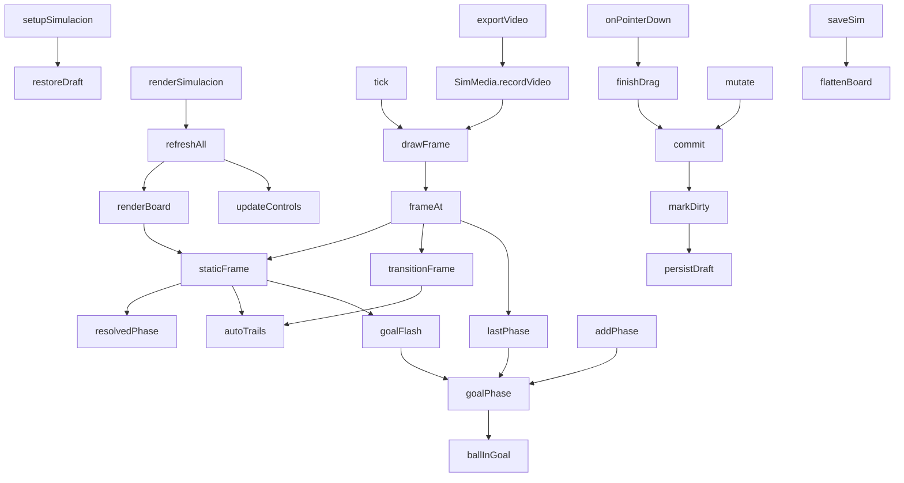

# js/simulacion.js

La pestaña **Simulación**: una jugada animada en fases. Es distinta de
[Táctica](tactica.md) (una jugada dibujada, una sola foto): acá la jugada
tiene varias **fases**, cada una con nombre, nota y tiempo, y al reproducirla
las jugadoras, los rivales y la pelota se deslizan de una fase a la
siguiente. Cada fase se arma **arrastrando las piezas**, con una grilla de
casilleros, cuadros de texto y zonas sombreadas por fase. Si la pelota entra
a un arco es gol y la jugada termina. Se guarda con nombre, forma un
historial y se descarga como video MP4.

Antes tenía "acciones de transición" (avanzar dos casilleros, pase a Agos,
tiro al arco...). Se sacaron porque no se les veía el uso: ahora la
transición es solo lo que cambia de una fase a la siguiente. Las simulaciones
guardadas con acciones se abren igual (las acciones se descartan al leerlas)
y los estilos de pelota (por arriba, tiro) quedaron solo en
[Secuencia](secuencia.md).

Está dentro de una función que se ejecuta sola (IIFE) y solo expone
`window.setupSimulacion`, `window.renderSimulacion` y `window.SimTemplates`,
que [js/app.js](app.md) y [js/secuencia.js](secuencia.md) usan. Depende de
[js/simulacion-media.js](simulacion-media.md) (el dibujo y la grabación) y
de `app.js` (`state`, `saveState`, `sanitizeSimItems`, `MAX_SIM_PHASES`...).

## Modelo de datos

```
state.simulations = [
  { id, name, createdAt, updatedAt, deleted, items: [...] }
]
```

Los `items` son una lista plana (así entra sin cambios en la hoja
`Simulaciones`, que tiene el mismo formato que `Tacticas`; por eso sumar
tipos nuevos no exige volver a pegar el Apps Script):

| type | campos | qué es |
|---|---|---|
| `phase` | `ph, name, note, dur` | una por fase: nombre, nota y segundos de la transición **hacia** esa fase |
| `player` | `ph, x, y, name` | una jugadora en esa fase |
| `rival` | `ph, x, y, label` | un rival (1 a 11) |
| `ball` | `ph, x, y, carrier` | la pelota; `carrier` es la clave de quien la lleva (`p:Ine`, `r:3`) o `''` si está suelta |
| `text` | `ph, x, y, text, color` | un cuadro de texto que aparece solo en esa fase |
| `zone` | `ph, zc, zr, color` | un casillero sombreado en esa fase (columna 0-2, fila 1-4) |

`ph` es el número de fase (0 a 11). En memoria (`board`) las fases están
aparte (`board.phases = [{ name, note, dur }]`) y solo al guardar
(`flattenBoard`) se vuelven a mezclar con los items; `splitFlat` hace lo
inverso al abrir y solo conserva los items de fase (los `action` viejos y los
de una secuencia se ignoran).

**Identidad entre fases.** Para animar hay que saber qué pieza de una fase es
la misma de la siguiente: una jugadora se identifica por su nombre, un rival
por su número (`keyOf`) y la pelota es siempre una sola (`b:ball`). Por eso
"+ Fase" copia las piezas tal cual (solo las piezas: no los textos ni los
casilleros): cada fase parte de la anterior y solo se mueve lo que cambia.

## Flujo interno



## Grilla de casilleros

La cancha se divide en **3 columnas por 4 filas**: columnas A, B y C de
izquierda a derecha; filas 1 a 4 contadas desde el arco propio (1 defensa
baja, 2 defensa alta, 3 ataque bajo, 4 ataque alto). Los casilleros se
alinean con las líneas de la cancha (10-290 x 10-390), así que miden
280/3 x 95. `cellAt(x, y)` dice en cuál casillero cae un punto y
`M.cellRect(c, r)` es su rectángulo (en
[simulacion-media.js](simulacion-media.md)). "Ver grilla" la dibuja con los
nombres (A1 a C4); con la herramienta Zona se muestra sola. Hoy sirve para
sombrear zonas y como referencia para hablar de la jugada.

## Arcos y gol: `ballInGoal` / `goalPhase` / `lastPhase` / `goalFlash`

La cancha tiene un arco arriba y otro abajo (dibujados por
[simulacion-media.js](simulacion-media.md)). **Si la pelota está adentro de un
arco, es gol y la jugada termina.** "Adentro" lo decide `M.goalSide(x, y)`:
entre los postes (x de 122 a 178) y pasada la línea de fondo (y de 10 o menos
arriba, 390 o más abajo). Una pelota que llega justo a la boca del arco, sin
pasar la línea, es un tiro y no un gol.

- **`ballInGoal(ph)`**: la pelota de esa fase (ya resuelta, o sea con su
  posición calculada si va pegada a una jugadora) ¿está adentro de un arco?
- **`goalPhase()`**: la primera fase donde eso pasa (-1 si nunca).
- **`lastPhase()`**: hasta qué fase se reproduce: la del gol, o la última si
  no hubo gol. Las fases que hubiera después **no se reproducen ni se graban en
  el video**; en las solapas quedan marcadas (`after-goal`).
- **`goalFlash(ph, alfa)`**: los carteles "¡GOL!" (amarillo) y "FIN" (blanco)
  en la fase del gol, en el lugar más despejado (`roomiestPoint`) para no tapar
  fichas. Aparecen al final de la transición que llega al gol y quedan.
- **Pausa más larga** en la fase del gol (`holdMs` suma 1,4 s) para alcanzar a
  ver el cartel, y el subtítulo dice "· ¡Gol! Fin" (`captionFor`).
- **`+ Fase` se bloquea** cuando la fase actual ya es la del gol (o está
  después): avisa que la jugada terminó. Se puede agregar antes del gol o sacar
  la pelota del arco.

## Cómo se anima

`transitionFrame(ph, p)` interpola cada pieza entre las dos fases con la misma
curva suave (`ease`): todo se mueve a la vez durante los `dur` segundos de la
fase de llegada. La pelota pegada a una jugadora va con ella (su posición se
calcula, ver `resolvedPhase`), y un pase es simplemente que el `carrier`
cambie de una fase a la siguiente. Las flechas de recorrido se calculan de la
diferencia entre las dos fases (`autoTrails`).

Los textos y casilleros sombreados no se interpolan: los de la fase que
termina se apagan al empezar la transición y los de la que llega aparecen
al final.

## Lo que se ve: `resolvedPhase` / `autoTrails` / `staticFrame`

- **`resolvedPhase(ph)`**: las piezas de una fase con la pelota ya
  colocada. La pelota "pegada" a una jugadora no guarda su posición como
  verdad: se calcula a partir de quien la lleva (`carrier`) más un desvío
  fijo (`BALL_DX`, `BALL_DY`), así siempre la acompaña.
- **`autoTrails(from, to, progressOf, alpha)`**: las flechas de recorrido
  (de dónde vino cada pieza que se movió). Se calculan, no se guardan. La
  punta queda unos píxeles antes de la ficha, así que un movimiento muy
  corto (menos de unas 23 unidades) no dibuja nada. La pelota que va con la
  misma jugadora en las dos fases no suma flecha propia.
- **`staticFrame(ph)`**: una fase quieta, más las flechas de la transición
  que llegó hasta ella, el cartel de gol si corresponde y la grilla si está
  activa.

## Línea de tiempo: `holdMs` / `moveMs` / `totalMs` / `frameAt`

Cada fase se "sostiene" un rato (0,9 s, o 2,2 s si tiene nota, para dar
tiempo a leerla) y entre fases hay una transición de `dur` segundos
(elegible por fase, de 0,5 a 6). `totalMs()` los suma **hasta `lastPhase()`**
y `frameAt(t)` devuelve el estado visual a los `t` ms (a velocidad 1x).
Durante una transición el texto que se muestra es el de la fase **de llegada**.

## Editar: punteros, herramientas y piezas

Un único juego de eventos sobre el `<svg>` (con *pointer capture*, ver
[[Pointer Events / pointer capture]]). Herramientas (`simTool`):

- **Mover**: arrastrar fichas, la pelota y los textos. Una ficha arrastrada
  **afuera de la cancha** se saca de esa fase. Al soltar la pelota a menos
  de 20 de una ficha se pega a ella; mover a quien la lleva la arrastra. La
  pelota se puede soltar adentro de un arco: eso es el gol.
- **Texto**: escribir en la barra y tocar la cancha. Vuelve a Mover con el
  texto seleccionado (se edita en la misma barra, se arrastra y cambia de
  color con la paleta).
- **Zona**: tocar un casillero para sombrearlo (`toggleZone`); tocarlo con
  el mismo color lo saca y con otro lo recolorea.

`#simSelBar` (la barra de la ficha elegida: cambiar por otra jugadora, dar o
soltar la pelota, quitar de la fase) **ocupa siempre el mismo alto**: sin
nada elegido muestra una ayuda. Si apareciera y desapareciera, el alto de la
página cambiaría al tocar una ficha y, con la página desplazada hasta el
fondo, el navegador corría el scroll y la cancha se movía en pleno arrastre
(bug real que hubo). Por el mismo motivo `#panel-simulacion` tiene
`overflow-anchor: none`.

Otras acciones sobre las piezas: `renamePlayer` (en todas las fases),
`assignRoster` (reemplaza los puestos de una jugada de ejemplo por
jugadoras del plantel según su posición), `importFromFormation` y las fichas
de la lista.

## Fases: `addPhase` / `removePhase` / `goPhase`

`addPhase` inserta una fase **después de la actual** con las mismas piezas en
el mismo lugar (corre los números de las siguientes); no deja agregar si la
fase actual es la del gol o está después. `removePhase` la quita y reordena.
Nombre, nota y tiempo se editan en campos que arman un solo punto de
"deshacer" por edición (`bindPhaseField`). Deshacer y Rehacer guardan una foto
de `{ items, phases }`, así que también deshacen agregar o quitar fases.

## Reproducir: `play` / `pause` / `tick` / `drawFrame` / `scrubTo`

`tick` corre con `requestAnimationFrame`, suma el tiempo real multiplicado
por la velocidad (0,5x, 1x, 2x) y dibuja con `drawFrame`, que pinta el SVG,
actualiza el texto de la fase (`#simCaption`) y el avance. Se pausa solo si
se cambia de pestaña. "Repetir" vuelve a empezar; el deslizador mueve el
punto de reproducción. Al reproducir la página entra en modo `sim-playing`
(herramientas y lista de jugadoras quedan deshabilitadas) hasta apretar
"Volver a editar" o una pestaña de fase.

## Guardar y abrir

Igual que en Táctica: `saveSim` (con `asCopy`), `openSim`, `newSim`,
`guard` (barra "cambios sin guardar"), eliminar en dos toques con borrado
"blando" (ver [[eliminación blanda (soft delete)]]) y un borrador en
`localStorage` (`dtcomander_sim_draft`) mientras hay cambios sin guardar.

La lista `state.simulations` también guarda las secuencias de la pestaña
[Secuencia](secuencia.md) (otro modelo de la misma hoja): `visibleSims()` las
oculta porque tienen un item `seq`. Y `window.SimTemplates` expone
`TEMPLATES`, `OUR_BASE` y `RIV_BASE` para que Secuencia arme sus jugadas de
ejemplo a partir de las mismas.

## Punto de partida: `boardFromTemplate` / `boardFromTactic`

- **Jugadas de ejemplo** (`TEMPLATES`): salir jugando de abajo, ataque desde
  medio campo, saque de arco, pase de delantera y jugada de pared. Parten de
  una formación 2-3-2 propia (abajo, atacando hacia arriba) y una rival; cada
  paso solo dice lo que cambia respecto del anterior, con sus casilleros
  sombreados y textos. Los pasos que terminan en tiro o gol traen un `ballAct`
  (`shot`, `goal`) que acá solo decide dónde queda la pelota (en la boca del
  arco o adentro) y que Secuencia además usa para el tipo de movimiento. Las
  jugadas "ataque desde medio campo" y "pase de delantera" terminan en gol;
  "jugada de pared" termina en tiro afuera del arco.
- **Desde una táctica** (`boardFromTactic`): toma las jugadoras, rivales y la
  primera pelota de una táctica guardada como fase 1 (descarta flechas,
  trazos y textos). Es una copia: la táctica original no cambia.

## Descargar video: `exportVideo`

Pasa a modo reproducción, bloquea los controles y llama a
`SimMedia.recordVideo`, que le pide cada cuadro con `getFrame(ms)`: ahí se
calcula el estado a ese momento (a la velocidad elegida), se pinta también
en pantalla y se devuelve para pintar en el video. El video lleva todo lo
que se ve (casilleros, textos, arcos, cartel de gol y fin) y, si "Ver
grilla" está activa, la grilla. Termina en la fase del gol si la hay. Al
terminar entrega el archivo con `deliverFile`: en celulares abre el menú de
compartir (WhatsApp) y en compu lo descarga (`.mp4`, o `.webm` si el
navegador no graba MP4).

## Dependencias

| Dependencia | Para qué |
|---|---|
| [js/simulacion-media.js](simulacion-media.md) | dibujo (SVG y canvas), arcos, grilla y grabación de video |
| [js/app.js](app.md) | estado, `saveState`, `sanitizeSimItems`, fechas, colores, `FIELD_BOUNDS` |
| `localStorage` | borrador (`dtcomander_sim_draft`) |
| `navigator.share` | compartir el video desde el celular |

Ver también el [Glosario](../GLOSSARY.md).
