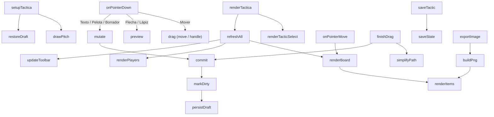

# js/tactica.js

La pestaña **Táctica**: un tablero libre para planear jugadas (córner,
salida desde el fondo, presión) con jugadoras propias, rivales, flechas,
lápiz, texto y pelota. Es distinto de Formación: allá se define *quién
juega dónde* en un partido; acá se dibuja *cómo se juega una jugada*. Cada
táctica se guarda con nombre (ver [[táctica (tactic)]] en el
[Glosario](../GLOSSARY.md)), forma un historial que se puede reabrir, y se
puede exportar como imagen para mandarla por WhatsApp.

Está dentro de una función que se ejecuta sola (IIFE) para no chocar con
los nombres de [js/app.js](app.md), y solo expone `window.setupTactica` y
`window.renderTactica`, que `app.js` llama (con un `typeof` de por medio:
si este archivo no cargara, el resto de la app sigue andando). Usa de
`app.js`: `state`, `saveState`, `currentPlan`, `currentMatch`,
`matchLabel`, `formatDateDisplay`, `colorForPosition`, `moveGhost`,
`FIELD_BOUNDS` y `sanitizeTacticItems`.

## Modelo de datos

```
state.tactics = [
  { id, name, createdAt, updatedAt, deleted, items: [...] }
]
```

Los `items` son lo dibujado; cada uno tiene `id` y `type`:

| type | campos | se dibuja como |
|---|---|---|
| `player` | `x, y, name` | círculo azul con la inicial y el nombre debajo |
| `rival` | `x, y, label` | círculo rojo con su número (1 a 11) |
| `ball` | `x, y` | pelota chica |
| `text` | `x, y, text, color` | texto con borde oscuro para que se lea sobre el pasto |
| `arrow` | `x1, y1, x2, y2, color, dash` | línea (continua o punteada) con punta triangular |
| `path` | `points[[x, y]...], color` | trazo a mano alzada |

Todas las coordenadas están en el `viewBox` de la cancha (0-300 x 0-400,
ver [[viewBox (SVG)]]), el mismo de Formación, por eso "Traer de
Formación" copia las posiciones tal cual.

`board` (variable interna) es la táctica que se está editando: `{ id,
name, items, dirty }`. **No** vive en `state.tactics` hasta que se aprieta
"Guardar"; mientras hay cambios sin guardar se copia a `localStorage`
(`dtcomander_tactic_draft`) para que un refresco accidental no los pierda.

## Flujo interno



## Dibujo: `drawPitch` / `renderItems` / `renderToken` ... `renderPath`

La cancha y cada elemento se crean como nodos SVG con **atributos propios**
(`fill`, `stroke`, ...) y no con clases de CSS. Es a propósito: la
exportación a imagen serializa el SVG y lo dibuja aparte, donde la hoja de
estilos de la página ya no existe.

`renderItems` dibuja en orden de capas (`DRAW_ORDER`: trazos, flechas,
jugadoras y rivales, pelota, texto), sin importar el orden en que se
crearon. Así un dibujo hecho después nunca tapa a una jugadora ni le roba
el toque cuando se la quiere mover. Las flechas y los trazos llevan además
una línea invisible más ancha (16 unidades) que hace de "zona de toque",
porque una línea de 2,6 unidades es imposible de agarrar con el dedo. La
punta de la flecha se calcula a mano como un triángulo (no con un
`marker` SVG) para que se vea igual al exportar.

## Punteros: `onPointerDown` / `onPointerMove` / `finishDrag`

Un único juego de eventos sobre el `<svg>` (con *pointer capture*, ver
[[Pointer Events / pointer capture]]) atiende todas las herramientas
según `tool`:

- **Mover**: tocar un elemento lo selecciona y arrastrarlo lo mueve. Las
  flechas seleccionadas muestran dos puntas para cambiar cada extremo. Una
  jugadora o un rival arrastrado **afuera de la cancha** se saca (vuelve a
  la lista): mientras se arrastra queda semitransparente y sigue al cursor
  porque el SVG tiene `overflow: visible`.
- **Flecha / Lápiz**: el elemento en construcción es `preview` (no
  cuenta hasta que se suelta). Un toque corto (flecha de menos de 8
  unidades, trazo de un solo punto) se descarta.
- **Texto / Pelota**: un toque coloca el elemento y la herramienta vuelve
  a Mover, con el elemento seleccionado.
- **Borrador**: un toque sobre un elemento lo borra.

Cambiar el color con algo seleccionado (flecha, trazo o texto) se lo
cambia a ese elemento; sin selección, define el color de lo próximo que
se dibuje. Lo mismo con "Punteada" para las flechas.

## Deshacer: `commit(before)` / `mutate(fn)`

Cada gesto guarda una "foto" (`JSON.stringify` de `items`) al empezar y,
al terminar, `commit` la apila en `undoStack` **solo si algo cambió**. Así
un toque sin efecto no ensucia el historial. `mutate(fn)` es lo mismo para
cambios instantáneos (borrar, colocar, cambiar de color). Hay hasta 60
pasos; Deshacer/Rehacer también responden a Ctrl/Cmd+Z y Ctrl/Cmd+Shift+Z,
y Supr/Borrar elimina la selección.

## `simplifyPath(points, epsilon)`

Aplica el algoritmo de Ramer–Douglas–Peucker (ver
[[simplificación de trazos]]) a un trazo a mano al soltar el dedo: de
cientos de puntos deja los pocos que conservan su forma. Sin esto un
dibujo largo pesaría de más al guardarse en la Sheet (una celda aguanta
50.000 caracteres).

## Guardar y abrir: `saveTactic` / `openTactic` / `guard` / `newTactic`

- **`saveTactic(asCopy)`**: exige nombre; crea o actualiza la táctica en
  `state.tactics` (con `updatedAt` nuevo) y llama a `saveState()`, que la
  manda a la Sheet. `asCopy` crea una nueva aunque ya exista una con ese
  nombre (le agrega " (copia)" si el nombre no cambió).
- **`guard(action)`**: antes de abrir otra táctica o empezar una nueva,
  si hay cambios sin guardar muestra una barra inline con "Guardar y
  seguir / Descartar / Cancelar" (el `confirm()` del navegador está
  bloqueado en varias vistas embebidas).
- **Eliminar**: doble toque (patrón "armado" de la app). No borra la fila:
  la marca `deleted: true` y vacía el dibujo (ver
  [[eliminación blanda (soft delete)]]).

## `importFromFormation()` / `addRival()` / `onChipPointerDown()`

"Traer de Formación" copia las jugadoras ubicadas en la forma activa del
partido y plan que estén abiertos en la pestaña Formación (si ya estaban
en el tablero, las reubica). Son copias: después el tablero es
independiente. `addRival()` toma el primer número libre (1 a 11) y un
lugar libre en la mitad de arriba. Las fichas de la lista se arrastran a
la cancha con el mismo "ghost" que en Formación, y un toque simple (sin
arrastrar) las coloca en un lugar libre — pensado para el celular.

## `exportImage()` / `buildPng()`

Arma un SVG nuevo con la cancha y los elementos (sin marcas de selección),
lo dibuja en un `<canvas>` de 900 x 1330 px, le suma arriba una franja azul
con el nombre de la táctica, la fecha y el escudo (en una chapita blanca,
porque el PNG del escudo tiene fondo blanco) y lo convierte a PNG. En
celulares (`pointer: coarse`) abre el menú de compartir del sistema
(WhatsApp, etc.) con `navigator.share`; en compu, o si eso falla, lo
descarga con el nombre de la táctica (`salida-desde-el-fondo.png`).

## Dependencias

| Dependencia | Para qué |
|---|---|
| [js/app.js](app.md) | estado, `saveState`, helpers de fechas/colores, `sanitizeTacticItems` |
| `localStorage` | borrador (`dtcomander_tactic_draft`) |
| `navigator.share` / `<canvas>` | exportar la imagen |
| `images/escudo-faltajue.png` | escudo de la imagen exportada (opcional) |

Ver también el [Glosario](../GLOSSARY.md).
